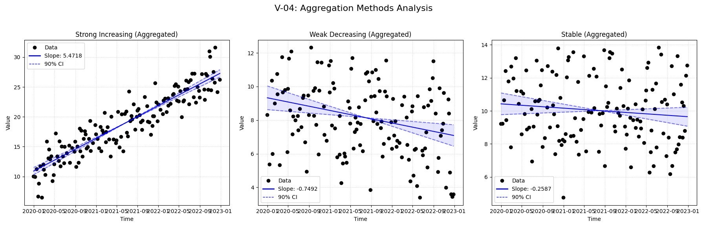

# Validation Case V-04: Aggregation Methods

## Case Description
This validation case verifies the `agg_method` options for handling multiple observations per time period, specifically comparing the standard MannKS behavior against the LWP-TRENDS R script which enforces aggregation (e.g., one value per month). To ensure deterministic results, observations are distributed throughout the month, avoiding identical timestamps and ambiguous tie-breaking.

Three scenarios were tested:
1.  **Strong Increasing Trend:** A clear, statistically significant positive trend.
2.  **Weak Decreasing Trend:** A subtle, statistically significant (or borderline) negative trend.
3.  **Stable (No Trend):** Data with no underlying trend.

## Combined Results

## Results Table
| Test ID                | Method            |     Slope |     P-Value |   Lower CI |    Upper CI |
|:-----------------------|:------------------|----------:|------------:|-----------:|------------:|
| V-04_Strong_Increasing | MannKS (Standard) |  5.47182  | 0           |   5.06962  |   5.8874    |
| V-04_Strong_Increasing | MannKS (LWP Mode) |  5.34763  | 8.09654e-10 |   4.27101  |   6.26123   |
| V-04_Strong_Increasing | LWP-TRENDS (R)    |  5.34763  | 8.09654e-10 |   4.51229  |   6.18379   |
| V-04_Strong_Increasing | MannKS (ATS)      |  5.47182  | 0           |   5.06962  |   5.8874    |
| V-04_Strong_Increasing | NADA2 (R)         |  5.47513  | 0           | nan        | nan         |
| V-04_Weak_Decreasing   | MannKS (Standard) | -0.749227 | 0.00095686  |  -1.19667  |  -0.301578  |
| V-04_Weak_Decreasing   | MannKS (LWP Mode) | -0.805907 | 0.123765    |  -1.71387  |   0.225312  |
| V-04_Weak_Decreasing   | LWP-TRENDS (R)    | -0.805907 | 0.123765    |  -1.62762  |   0.0743976 |
| V-04_Weak_Decreasing   | MannKS (ATS)      | -0.749227 | 0.00095686  |  -1.19667  |  -0.301578  |
| V-04_Weak_Decreasing   | NADA2 (R)         | -0.749518 | 0.00095686  | nan        | nan         |
| V-04_Stable            | MannKS (Standard) | -0.258738 | 0.217184    |  -0.672275 |   0.15028   |
| V-04_Stable            | MannKS (LWP Mode) | -0.528518 | 0.144996    |  -1.19137  |   0.176661  |
| V-04_Stable            | LWP-TRENDS (R)    | -0.528518 | 0.144996    |  -1.14131  |   0.0462097 |
| V-04_Stable            | MannKS (ATS)      | -0.258738 | 0.217184    |  -0.672275 |   0.15028   |
| V-04_Stable            | NADA2 (R)         | -0.25879  | 0.217184    | nan        | nan         |

## LWP Accuracy (Python vs R)
| Test ID                |   Slope Error |   Slope % Error |
|:-----------------------|--------------:|----------------:|
| V-04_Strong_Increasing |   0           |     0           |
| V-04_Weak_Decreasing   |   1.11022e-16 |    -9.25186e-15 |
| V-04_Stable            |  -1.11022e-16 |     2.10063e-14 |
