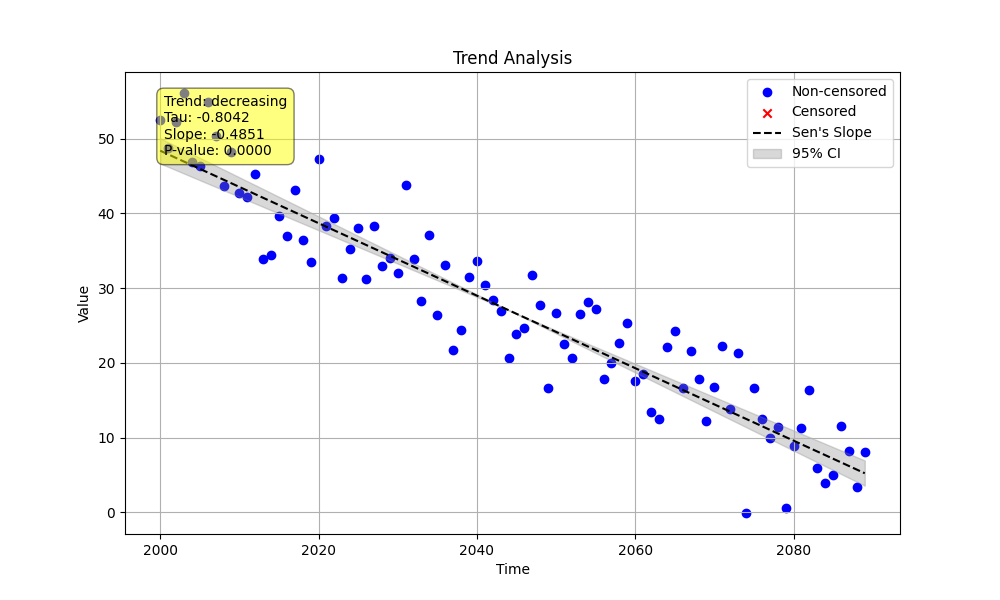

# Validation 05: Decreasing Trend

This validation example compares the `MannKenSen` package against the LWP-TRENDS R script for a simple decreasing trend with normally distributed noise.

## Method

1.  A Python script (`decreasing_trend_validation.py`) was used to generate a synthetic dataset with a known decreasing trend (`slope = -0.5`).
2.  The script saved the data to `validation_data.csv`.
3.  The script then performed a trend analysis using the `MannKenSen` package.
4.  An R script (`run_lwp_validation.R`) was used to perform a trend analysis on the same `validation_data.csv` using the LWP-TRENDS `NonSeasonalTrendAnalysis` function.

## Python `MannKenSen` Results

```
--- MannKenSen Analysis Results ---
  Classification: Highly Likely Decreasing
  Trend Exists: True
  P-value: 0.0000
  Sen's Slope: -0.4851
  Confidence Interval: -0.5225 to -0.4465
```



## R `LWP-TRENDS` Results

```
--- LWP-TRENDS Analysis Results ---
  P-value: 0.0000
  Z-statistic: -11.2225
  Slope: -0.4851 (-0.5170, -0.4526)
  Trend Classification: Highly likely
```

## Comparison

| Metric | MannKenSen | LWP-TRENDS |
| :--- | :--- | :--- |
| **Sen's Slope** | -0.4851 | -0.4851 |
| **P-value** | < 0.0001 | < 0.0001 |
| **Lower CI** | -0.5225 | -0.5170 |
| **Upper CI** | -0.4465 | -0.4526 |
| **Classification** | Highly Likely Decreasing | Highly likely |

The results are highly consistent. Both packages correctly identify a statistically significant decreasing trend. The Sen's slope is identical, and the confidence intervals are very similar, confirming that the core statistical calculations are aligned for this type of data.
