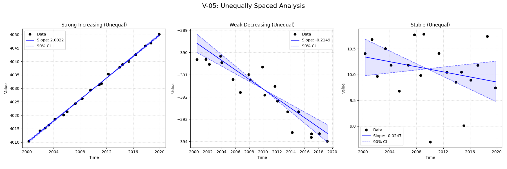
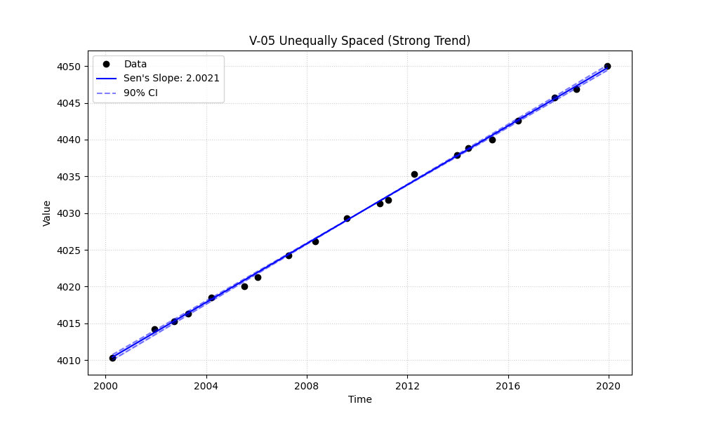

# Validation Report

**V-05: Unequally Spaced Time Series**

*   **Objective:** Verify a core feature of `mannkensen` on a non-seasonal, unequally spaced time series.
*   **Data Description:** Data with a clear trend but with random, non-uniform time gaps between samples. This test highlights a key methodological difference where the R script is expected to differ.

## Plots
### v05_combined.png

### v05_strong.png

## Results
               Test ID                Method         Slope      P-Value      Lower CI      Upper CI
V-05_strong_increasing MannKenSen (Standard)  2.002182e+00 8.679764e-10  1.968230e+00  2.040470e+00
V-05_strong_increasing MannKenSen (LWP Mode)  2.002182e+00 8.679764e-10  1.968196e+00  2.040713e+00
V-05_strong_increasing        LWP-TRENDS (R)  2.002182e+00 8.679763e-10  1.974514e+00  2.029499e+00
V-05_strong_increasing      MannKenSen (ATS)  6.344531e-08 8.679764e-10  6.236945e-08  6.465858e-08
V-05_strong_increasing             NADA2 (R)  2.001958e+00 8.679764e-10           NaN           NaN
  V-05_weak_decreasing MannKenSen (Standard) -2.149025e-01 9.628305e-07 -2.574432e-01 -1.720918e-01
  V-05_weak_decreasing MannKenSen (LWP Mode) -2.149025e-01 9.628305e-07 -2.574517e-01 -1.720618e-01
  V-05_weak_decreasing        LWP-TRENDS (R) -2.149025e-01 9.628305e-07 -2.476722e-01 -1.802237e-01
  V-05_weak_decreasing      MannKenSen (ATS) -6.809850e-09 9.628305e-07 -8.157883e-09 -5.453259e-09
  V-05_weak_decreasing             NADA2 (R) -2.149346e-01 9.628305e-07           NaN           NaN
           V-05_stable MannKenSen (Standard) -2.469297e-02 2.299691e-01 -6.191474e-02  1.430605e-02
           V-05_stable MannKenSen (LWP Mode) -2.469297e-02 2.299691e-01 -6.202236e-02  1.431205e-02
           V-05_stable        LWP-TRENDS (R) -2.469297e-02 2.299691e-01 -5.198779e-02  6.918530e-03
           V-05_stable      MannKenSen (ATS) -7.824729e-10 2.299691e-01 -1.961960e-09  4.533313e-10
           V-05_stable             NADA2 (R) -2.468004e-02 2.299691e-01           NaN           NaN

## LWP Accuracy (Python vs R)
               Test ID  Slope Error  Slope % Error
V-05_strong_increasing 0.000000e+00   0.000000e+00
  V-05_weak_decreasing 2.775558e-17  -1.387779e-14
           V-05_stable 3.469447e-18  -1.405035e-14
