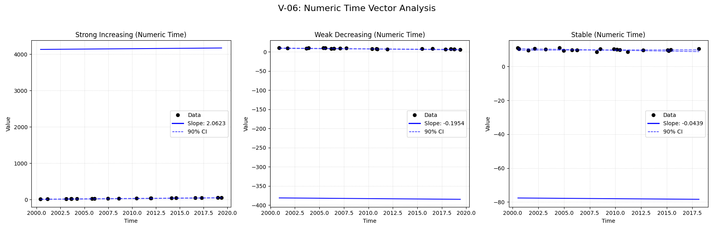
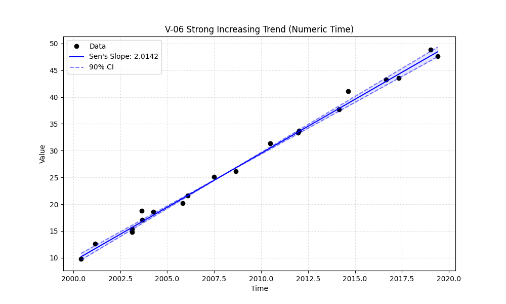

# Validation Report

## Plots
### v06_combined.png

### v06_strong.png

## Results
| Test ID                | Method            |      Slope |     P-Value |   Lower CI |    Upper CI |
|:-----------------------|:------------------|-----------:|------------:|-----------:|------------:|
| V-06_strong_increasing | MannKS (Standard) |  2.0142    | 4.29491e-09 |   1.9325   |   2.09168   |
| V-06_strong_increasing | MannKS (LWP Mode) |  2.0142    | 4.29491e-09 |   1.93189  |   2.09283   |
| V-06_strong_increasing | LWP-TRENDS (R)    |  1.99704   | 9.60085e-09 |   1.93266  |   2.06203   |
| V-06_strong_increasing | MannKS (ATS)      |  2.0142    | 4.29491e-09 |   1.9325   |   2.09168   |
| V-06_strong_increasing | NADA2 (R)         |  2.01422   | 4.29491e-09 | nan        | nan         |
| V-06_weak_decreasing   | MannKS (Standard) | -0.197647  | 5.00196e-05 |  -0.279662 |  -0.134133  |
| V-06_weak_decreasing   | MannKS (LWP Mode) | -0.197647  | 5.00196e-05 |  -0.279983 |  -0.133563  |
| V-06_weak_decreasing   | LWP-TRENDS (R)    | -0.197641  | 5.00196e-05 |  -0.2626   |  -0.142035  |
| V-06_weak_decreasing   | MannKS (ATS)      | -0.197647  | 5.00196e-05 |  -0.279662 |  -0.134133  |
| V-06_weak_decreasing   | NADA2 (R)         | -0.197666  | 5.00196e-05 | nan        | nan         |
| V-06_stable            | MannKS (Standard) | -0.0461515 | 0.162984    |  -0.11562  |   0.015953  |
| V-06_stable            | MannKS (LWP Mode) | -0.0461515 | 0.162984    |  -0.11586  |   0.016225  |
| V-06_stable            | LWP-TRENDS (R)    | -0.0461514 | 0.162984    |  -0.101955 |   0.0102742 |
| V-06_stable            | MannKS (ATS)      | -0.0461515 | 0.162984    |  -0.11562  |   0.015953  |
| V-06_stable            | NADA2 (R)         | -0.0461362 | 0.162984    | nan        | nan         |

## LWP Accuracy (Python vs R)
| Test ID                |   Slope Error |   Slope % Error |
|:-----------------------|--------------:|----------------:|
| V-06_strong_increasing |    0.0171613  |     0.858064    |
| V-06_weak_decreasing   |   -6.2377e-06 |     0.00311885  |
| V-06_stable            |   -1.0951e-07 |     0.000237284 |
