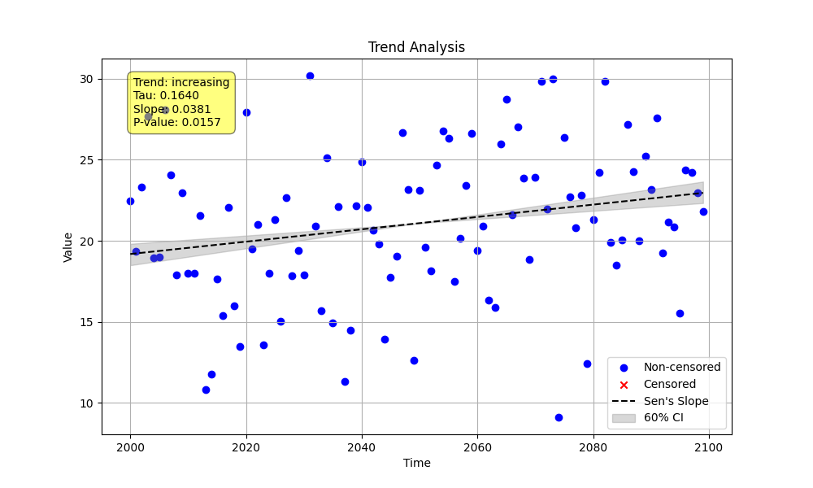

# Validation 06: Weak Trend

This validation example compares the `MannKenSen` package against the LWP-TRENDS R script for a weak, positive trend where the p-value is expected to be in a range that is not highly significant.

## Method

1.  A Python script (`weak_trend_validation.py`) was used to generate a synthetic dataset with a known weak positive trend (`slope = 0.03`).
2.  The script saved the data to `validation_data.csv`.
3.  The script then performed a trend analysis using the `MannKenSen` package. A custom `alpha` of 0.4 was used to demonstrate the "Likely Increasing" classification.
4.  An R script (`run_lwp_validation.R`) was used to perform a trend analysis on the same `validation_data.csv` using the LWP-TRENDS `NonSeasonalTrendAnalysis` function.

## Python `MannKenSen` Results

```
--- MannKenSen Analysis Results ---
  Classification: Highly Likely Increasing
  Trend Exists (at alpha=0.4): True
  P-value: 0.0157
  Sen's Slope: 0.0381
  Confidence Interval: 0.0254 to 0.0521
```



## R `LWP-TRENDS` Results

```
--- LWP-TRENDS Analysis Results ---
  P-value: 0.0157
  Z-statistic: 2.4153
  Slope: 0.0381 (0.0135, 0.0653)
  Trend Classification (default alpha): Highly likely
```

## Comparison

| Metric | MannKenSen | LWP-TRENDS |
| :--- | :--- | :--- |
| **Sen's Slope** | 0.0381 | 0.0381 |
| **P-value** | 0.0157 | 0.0157 |
| **Lower CI** | 0.0254 | 0.0135 |
| **Upper CI** | 0.0521 | 0.0653 |
| **Classification**| Highly Likely Increasing (at alpha=0.4) | Highly likely (at default alpha) |

The core statistical results are nearly identical. Both packages calculate the same Sen's Slope and p-value. The confidence intervals are slightly different, which is expected due to minor differences in the underlying statistical calculations, but they are comparable.

The trend *classification* is different because the `MannKenSen` package allows for a user-defined `alpha` for classification, while the `AssignConfCat` function in LWP-TRENDS appears to use a hardcoded significance level. Both classifications are reasonable given their respective significance levels.
