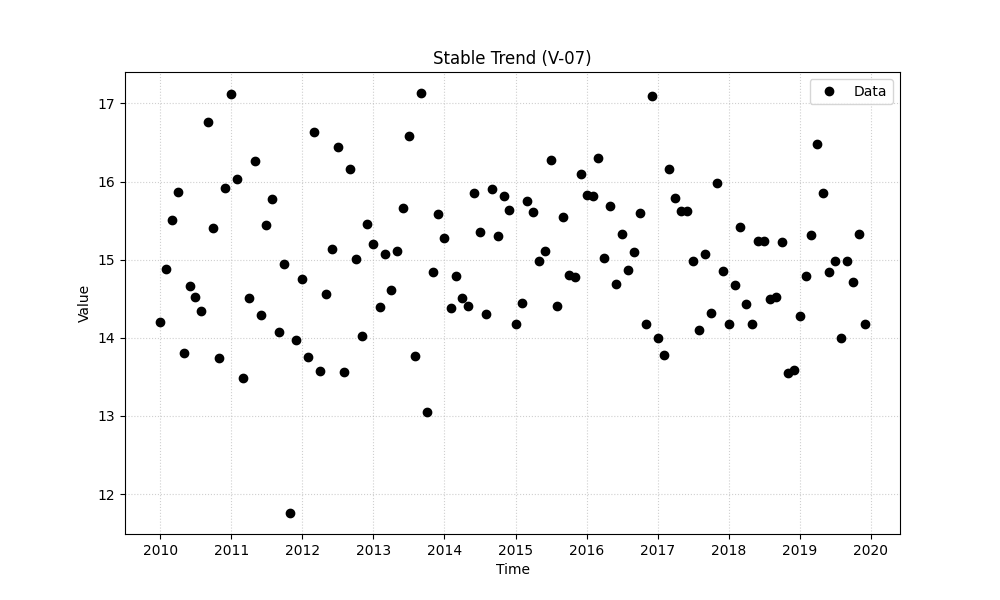
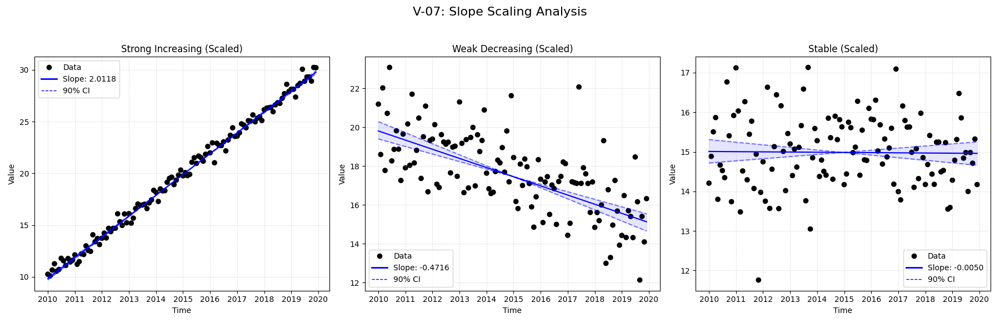
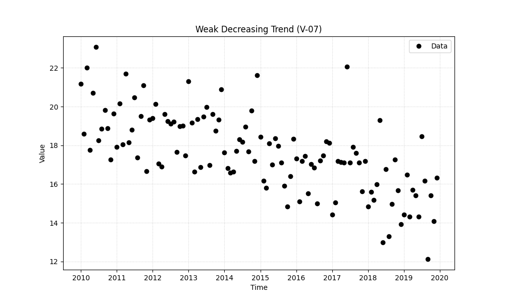

# Validation Report

## Plots
### stable.png

### strong_increasing.png

### v07_combined.png

### weak_decreasing.png

## Results
| Test ID                | Method            |       Slope |     P-Value |    Lower CI |    Upper CI |
|:-----------------------|:------------------|------------:|------------:|------------:|------------:|
| V-07_strong_increasing | MannKS (Standard) |  2.0118     | 0           |   1.98366   |   2.04116   |
| V-07_strong_increasing | MannKS (LWP Mode) |  2.0118     | 0           |   1.98366   |   2.04117   |
| V-07_strong_increasing | LWP-TRENDS (R)    |  2.0118     | 3.28888e-54 |   1.98857   |   2.03607   |
| V-07_strong_increasing | MannKS (ATS)      |  2.0118     | 0           |   1.98366   |   2.04116   |
| V-07_strong_increasing | NADA2 (R)         |  2.01183    | 0           | nan         | nan         |
| V-07_weak_decreasing   | MannKS (Standard) | -0.471572   | 1.55431e-15 |  -0.568274  |  -0.3883    |
| V-07_weak_decreasing   | MannKS (LWP Mode) | -0.471572   | 1.55431e-15 |  -0.568319  |  -0.388299  |
| V-07_weak_decreasing   | LWP-TRENDS (R)    | -0.471572   | 1.49446e-15 |  -0.553832  |  -0.401151  |
| V-07_weak_decreasing   | MannKS (ATS)      | -0.471572   | 1.55431e-15 |  -0.568274  |  -0.3883    |
| V-07_weak_decreasing   | NADA2 (R)         | -0.471554   | 1.55431e-15 | nan         | nan         |
| V-07_stable            | MannKS (Standard) | -0.00496374 | 0.843564    |  -0.0652887 |   0.0537564 |
| V-07_stable            | MannKS (LWP Mode) | -0.00496374 | 0.843564    |  -0.0652931 |   0.053762  |
| V-07_stable            | LWP-TRENDS (R)    | -0.00496374 | 0.843564    |  -0.0559808 |   0.0445408 |
| V-07_stable            | MannKS (ATS)      | -0.00496374 | 0.843564    |  -0.0652887 |   0.0537564 |
| V-07_stable            | NADA2 (R)         | -0.00496265 | 0.843564    | nan         | nan         |

## LWP Accuracy (Python vs R)
| Test ID                |   Slope Error |   Slope % Error |
|:-----------------------|--------------:|----------------:|
| V-07_strong_increasing |   4.44089e-16 |     2.22045e-14 |
| V-07_weak_decreasing   |   5.55112e-17 |    -1.11022e-14 |
| V-07_stable            |   8.67362e-19 |    -1.7474e-14  |
