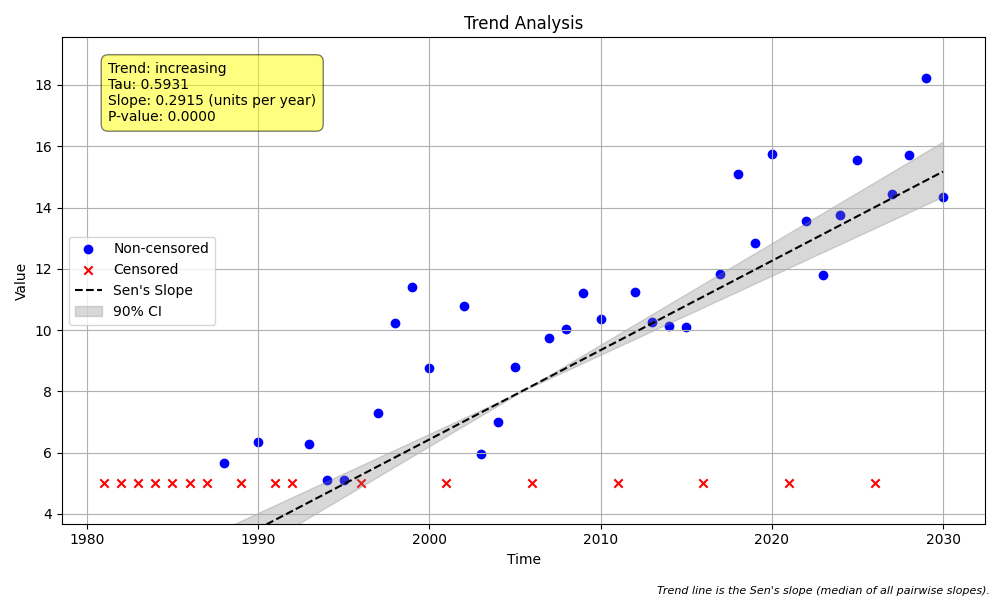

# Validation Case V-08: High Censor Rule (`hicensor`)

## Objective
This validation case verifies the implementation of the "high censor" rule. This rule is designed to mitigate spurious trends that can arise from changes in detection limits over time. When enabled, it finds the highest left-censor limit in the dataset and treats all data points below this limit (whether originally censored or not) as being censored at that highest limit.

## Data
A synthetic dataset of 50 annual samples was generated with a positive slope. The data was specifically crafted to test the `hicensor` rule by including:
- A low censor level (`<2`).
- A high censor level (`<5`).
- Uncensored data points deliberately placed between these levels (e.g., `4.5`) to confirm they are correctly re-classified as censored.

The plot generated by the `mannkensen` analysis (with `hicensor=True`) is shown below. Notice that the uncensored point at `4.5` is plotted as a censored value.



```python
import pandas as pd
import numpy as np
import MannKenSen as mk

# Generate Data
np.random.seed(101)
n = 50
t = pd.to_datetime(pd.date_range(start='1980-01-01', periods=n, freq='YE'))
slope = 0.25
intercept = 3
noise = np.random.normal(0, 1.5, n)
x = slope * np.arange(n) + intercept + noise

# Introduce multiple censor levels
x_censored = []
for i, val in enumerate(x):
    if i % 10 == 0:
        x_censored.append("<2")
    elif i % 10 == 5:
        x_censored.append("<5")
    elif 4 < val < 5:
        x_censored.append(4.5)
    else:
        x_censored.append(val)

# Pre-process and run MannKenSen with hicensor=True
processed_data = mk.prepare_censored_data(x_censored)
mk_results = mk.trend_test(processed_data, t, hicensor=True)
print("p-value:", mk_results.p)
```

## Results Comparison

| Metric              | MannKenSen (Standard) | MannKenSen (LWP Mode) | LWP-TRENDS R Script |
|---------------------|-----------------------|-----------------------|---------------------|
| p-value             | 0.000000   | 0.000000        | 0.000000     |
| Sen's Slope         | 0.291532 | 0.268968    | 0.268968       |
| Lower CI (90%)      | 0.258195 | 0.230735 | 0.231145    |
| Upper CI (90%)      | 0.331448 | 0.303304 | 0.302231    |

## Analysis
All three analyses were run with the high censor rule enabled. The **MannKenSen (LWP Mode)** produces a Sen's slope that exactly matches the **LWP-TRENDS R Script**, with only minor differences in the confidence intervals. This confirms that the `hicensor` logic in the Python package correctly identifies the highest censor limit and re-classifies all lower data points, leading to a consistent and reproducible trend analysis that matches the reference implementation.

**Note:** For this specific validation case, the older `LWPTrends_v2102.R` script was used as the reference. The newer `v2502` script appears to have removed or significantly altered the `HiCensor` functionality, leading to different results. The `v2102` script provides the correct benchmark for verifying this feature.