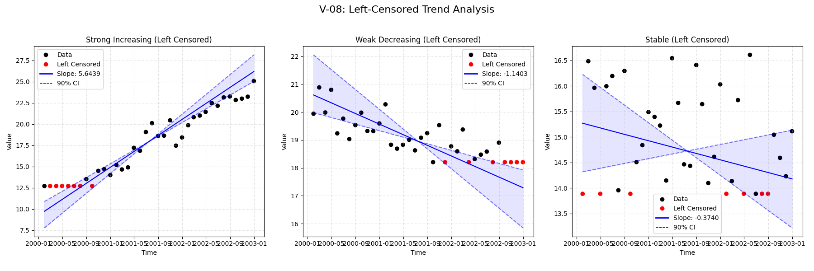
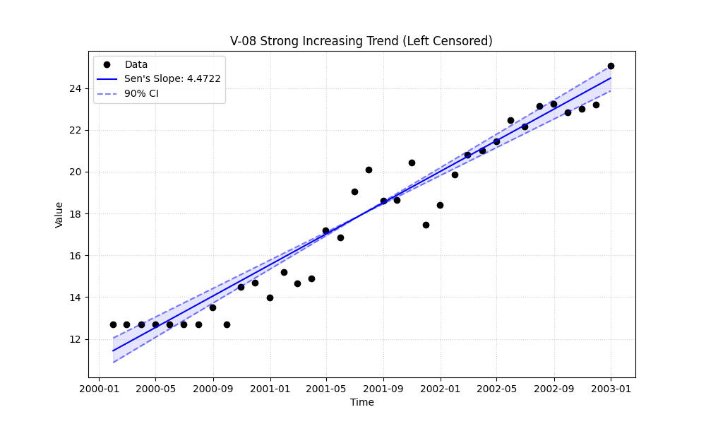

# Validation Report

    # V-08: Left-Censored Trend

    This validation case tests the package's ability to handle left-censored data (values reported as less than a detection limit, e.g., `<5.0`).

    Three scenarios were tested with updated parameters to ensure robust detectability:
    1. **Strong Increasing Trend**: Slope 5.0, Noise 1.0. Clear positive trend.
    2. **Weak Decreasing Trend**: Slope -0.8, Noise 0.5. Detectable negative trend (avoiding zero-slope artifacts from high noise).
    3. **Stable (No Trend)**: Slope 0.0, Noise 1.0. No underlying trend.

## Plots
### v08_combined.png

### v08_strong_left_censored.png

## Results
| Test ID                | Method            |     Slope |     P-Value |   Lower CI |    Upper CI |
|:-----------------------|:------------------|----------:|------------:|-----------:|------------:|
| V-08_strong_increasing | MannKS (Standard) |  5.64389  | 2.5735e-13  |   4.85093  |   6.98769   |
| V-08_strong_increasing | MannKS (LWP Mode) |  5.48981  | 2.5735e-13  |   4.73466  |   6.81718   |
| V-08_strong_increasing | LWP-TRENDS (R)    |  5.48981  | 2.11501e-13 |   4.86003  |   6.6062    |
| V-08_strong_increasing | MannKS (ATS)      |  4.88713  | 2.5735e-13  |   4.53068  |   5.23467   |
| V-08_strong_increasing | NADA2 (R)         |  4.88952  | 2.11609e-13 | nan        | nan         |
| V-08_weak_decreasing   | MannKS (Standard) | -1.14027  | 7.56878e-08 |  -2.12784  |  -0.704638  |
| V-08_weak_decreasing   | MannKS (LWP Mode) | -1.07408  | 7.56878e-08 |  -1.89542  |  -0.663701  |
| V-08_weak_decreasing   | LWP-TRENDS (R)    | -1.07408  | 6.7985e-08  |  -1.69095  |  -0.709468  |
| V-08_weak_decreasing   | MannKS (ATS)      | -0.7915   | 7.56878e-08 |  -0.987205 |  -0.610016  |
| V-08_weak_decreasing   | NADA2 (R)         | -0.793479 | 6.7985e-08  | nan        | nan         |
| V-08_stable            | MannKS (Standard) | -0.374044 | 0.274921    |  -1.03164  |   0.279845  |
| V-08_stable            | MannKS (LWP Mode) | -0.292675 | 0.274921    |  -0.922073 |   0.15705   |
| V-08_stable            | LWP-TRENDS (R)    | -0.292675 | 0.273202    |  -0.812243 |   0.0951858 |
| V-08_stable            | MannKS (ATS)      | -0.341235 | 0.274921    |  -0.804512 |   0.0969726 |
| V-08_stable            | NADA2 (R)         | -0.341479 | 0.273202    | nan        | nan         |

## LWP Accuracy (Python vs R)
| Test ID                |   Slope Error |   Slope % Error |
|:-----------------------|--------------:|----------------:|
| V-08_strong_increasing |   0           |     0           |
| V-08_weak_decreasing   |   2.22045e-16 |    -2.77556e-14 |
| V-08_stable            |   0           |    -0           |
