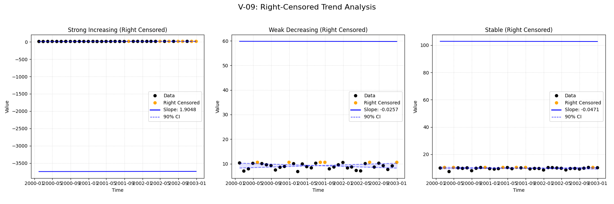
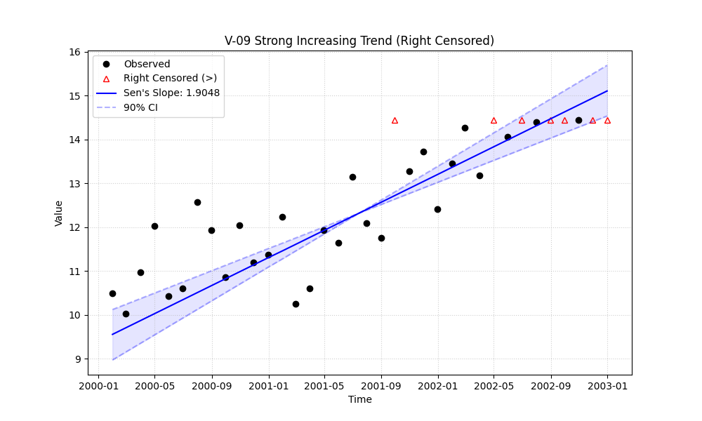

# Validation Report

    # V-09: Right-Censored Trend

    This validation case tests the package's ability to handle right-censored data (values reported as greater than a detection limit, e.g., `>5.0`).

    Three scenarios were tested:
    1. **Strong Increasing Trend**: Data with a clear positive slope, where higher values are censored.
    2. **Weak Decreasing Trend**: Data with a slight negative slope, where initial high values are censored.
    3. **Stable (No Trend)**: Random data with no trend, with some high values censored.

## Plots
### v09_combined.png

### v09_strong_right_censored.png

## Results
| Test ID                | Method            |      Slope |     P-Value |   Lower CI |   Upper CI |
|:-----------------------|:------------------|-----------:|------------:|-----------:|-----------:|
| V-09_strong_increasing | MannKS (Standard) |  1.90481   | 0.000300407 |   1.51476  |   2.30632  |
| V-09_strong_increasing | MannKS (LWP Mode) |  1.84793   | 5.55129e-09 |   1.45515  |   2.23949  |
| V-09_strong_increasing | LWP-TRENDS (R)    |  1.84793   | 4.80273e-09 |   1.51366  |   2.1891   |
| V-09_strong_increasing | MannKS (ATS)      |  1.70926   | 0.000300407 |   1.41185  |   2.01386  |
| V-09_strong_increasing | NADA2 (R)         |  1.282     | 0.000285164 | nan        | nan        |
| V-09_weak_decreasing   | MannKS (Standard) | -0.0256599 | 0.718302    |  -0.698598 |   0.678248 |
| V-09_weak_decreasing   | MannKS (LWP Mode) |  0         | 0.95655     |  -0.674868 |   0.640895 |
| V-09_weak_decreasing   | LWP-TRENDS (R)    |  0         | 0.956435    |  -0.485501 |   0.509951 |
| V-09_weak_decreasing   | MannKS (ATS)      | -0.0256599 | 0.718302    |  -0.542792 |   0.438748 |
| V-09_weak_decreasing   | NADA2 (R)         | -0.124127  | 0.717695    | nan        | nan        |
| V-09_stable            | MannKS (Standard) | -0.0471199 | 0.597264    |  -0.456799 |   0.301222 |
| V-09_stable            | MannKS (LWP Mode) |  0         | 0.848767    |  -0.400623 |   0.259358 |
| V-09_stable            | LWP-TRENDS (R)    |  0         | 0.848148    |  -0.332156 |   0.182018 |
| V-09_stable            | MannKS (ATS)      | -0.0279316 | 0.597264    |  -0.285574 |   0.19782  |
| V-09_stable            | NADA2 (R)         |  0.0653666 | 0.595899    | nan        | nan        |

## LWP Accuracy (Python vs R)
| Test ID                |   Slope Error |   Slope % Error |
|:-----------------------|--------------:|----------------:|
| V-09_strong_increasing |   2.22045e-16 |     1.11022e-14 |
| V-09_weak_decreasing   |   0           |    -0           |
| V-09_stable            |   0           |     0           |
