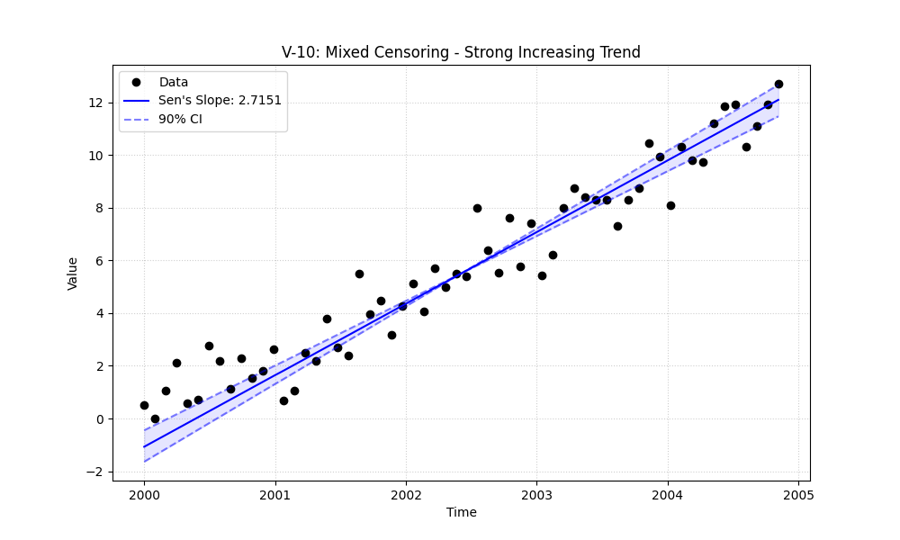
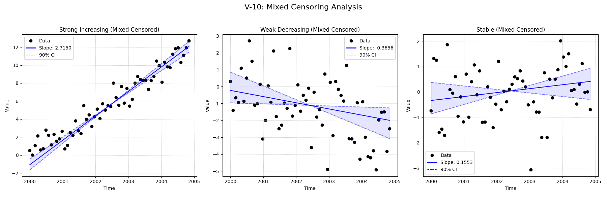

# Validation Report

## Plots
### V-10_strong_increasing_plot.png

### v10_combined.png

## Results
| Test ID                | Method            |     Slope |     P-Value |    Lower CI |     Upper CI |
|:-----------------------|:------------------|----------:|------------:|------------:|-------------:|
| V-10_Strong_Increasing | MannKS (Standard) |  2.715    | 2.82063e-12 |   2.45826   |   2.95109    |
| V-10_Strong_Increasing | MannKS (LWP Mode) |  2.39331  | 1.25568e-08 |   1.96979   |   2.6788     |
| V-10_Strong_Increasing | LWP-TRENDS (R)    |  2.36182  | 4.04396e-09 |   2.05494   |   2.61127    |
| V-10_Strong_Increasing | MannKS (ATS)      |  2.51629  | 2.82063e-12 |   2.3448    |   2.71953    |
| V-10_Strong_Increasing | NADA2 (R)         |  2.51903  | 2.82063e-12 | nan         | nan          |
| V-10_Weak_Decreasing   | MannKS (Standard) | -0.36556  | 0.0033235   |  -0.811011  |  -0.0614133  |
| V-10_Weak_Decreasing   | MannKS (LWP Mode) |  0        | 0.0918011   |  -0.121014  |   0          |
| V-10_Weak_Decreasing   | LWP-TRENDS (R)    |  0        | 0.0596148   |  -0.0990922 |   0          |
| V-10_Weak_Decreasing   | MannKS (ATS)      | -0.540799 | 0.0033235   |  -0.875311  |  -0.263147   |
| V-10_Weak_Decreasing   | NADA2 (R)         | -0.67191  | 0.0033235   | nan         | nan          |
| V-10_Stable            | MannKS (Standard) |  0.155321 | 0.462634    |  -0.138673  |   0.37226    |
| V-10_Stable            | MannKS (LWP Mode) |  0        | 0.204933    |   0         |   0.00449524 |
| V-10_Stable            | LWP-TRENDS (R)    |  0        | 0.151102    |   0         |   0          |
| V-10_Stable            | MannKS (ATS)      |  0.17667  | 0.462634    |  -0.0405962 |   0.37348    |
| V-10_Stable            | NADA2 (R)         |  0.119355 | 0.462634    | nan         | nan          |

## LWP Accuracy (Python vs R)
| Test ID                |   Slope Error |   Slope % Error |
|:-----------------------|--------------:|----------------:|
| V-10_Strong_Increasing |     0.0314917 |         1.31215 |
| V-10_Weak_Decreasing   |     0         |        -0       |
| V-10_Stable            |     0         |         0       |
