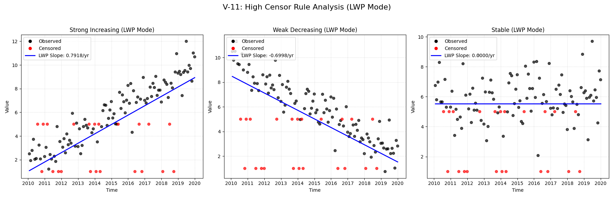

# V-11: High Censor Rule

## Objective
Verify the implementation of the 'High Censor Rule' (`hicensor=True`). This rule, used in older LWP-TRENDS versions, sets all values below the highest detection limit to be censored at that highest limit. This prevents spurious trends caused solely by changing detection limits (e.g., detection limit improves from <5 to <1 over time).

## Plots
### v11_combined.png

## Results
| Test ID                | Method            |      Slope |     P-Value |    Lower CI |    Upper CI |
|:-----------------------|:------------------|-----------:|------------:|------------:|------------:|
| V-11_strong_increasing | MannKS (Standard) |  0.865484  | 0           |   0.787276  |   0.948784  |
| V-11_strong_increasing | MannKS (LWP Mode) |  0.791823  | 0           |   0.688459  |   0.881396  |
| V-11_strong_increasing | LWP-TRENDS (R)    |  0.791823  | 3.49718e-24 |   0.713381  |   0.862459  |
| V-11_strong_increasing | MannKS (ATS)      |  0.83495   | 0           |   0.760002  |   0.911214  |
| V-11_strong_increasing | NADA2 (R)         |  0.835051  | 0           | nan         | nan         |
| V-11_weak_decreasing   | MannKS (Standard) | -0.766328  | 2.22045e-16 |  -0.851204  |  -0.679787  |
| V-11_weak_decreasing   | MannKS (LWP Mode) | -0.699787  | 6.66134e-16 |  -0.80478   |  -0.495237  |
| V-11_weak_decreasing   | LWP-TRENDS (R)    | -0.699787  | 1.87109e-18 |  -0.78224   |  -0.570792  |
| V-11_weak_decreasing   | MannKS (ATS)      | -0.720333  | 2.22045e-16 |  -0.796669  |  -0.63833   |
| V-11_weak_decreasing   | NADA2 (R)         | -0.720507  | 2.22045e-16 | nan         | nan         |
| V-11_stable            | MannKS (Standard) |  0.0984758 | 0.147989    |  -0.0319425 |   0.234739  |
| V-11_stable            | MannKS (LWP Mode) |  0         | 0.167481    |   0         |   0.0834025 |
| V-11_stable            | LWP-TRENDS (R)    |  0         | 0.155882    |   0         |   0.0535881 |
| V-11_stable            | MannKS (ATS)      |  0.0903797 | 0.147989    |  -0.0074037 |   0.19499   |
| V-11_stable            | NADA2 (R)         |  0.0904053 | 0.147663    | nan         | nan         |

## LWP Accuracy (Python vs R)
| Test ID                |   Slope Error |   Slope % Error |
|:-----------------------|--------------:|----------------:|
| V-11_strong_increasing |   1.11022e-16 |     1.40211e-14 |
| V-11_weak_decreasing   |   0           |    -0           |
| V-11_stable            |   0           |     0           |
