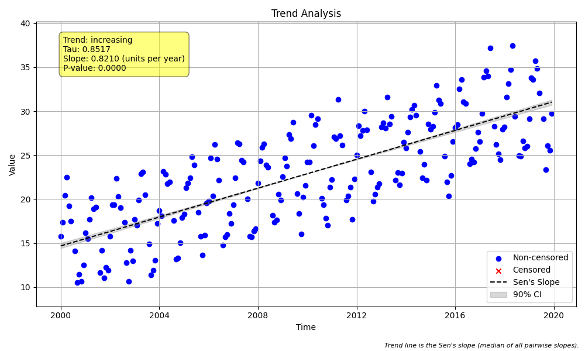

# Validation Case V-11: Seasonal Data with Missing Seasons

## Objective
This test verifies that the `seasonal_trend_test` function can gracefully handle datasets where an entire season is missing, and compares this behavior to the LWP-TRENDS script.

## Data
A synthetic dataset of 20 years of monthly data was generated with a strong seasonal cycle and a clear increasing trend. Subsequently, all data points for a single month (July, month 7) were removed from the dataset.

The plot below, generated by `mannkensen`, shows the resulting time series. Note the consistent annual gap in the data where the July observations would be.

## Results Comparison

| Metric              | MannKenSen (Standard) | MannKenSen (LWP Mode) | LWP-TRENDS R Script |
|---------------------|-----------------------|-----------------------|---------------------|
| p-value             | 0.000000   | 0.000000        | R Script Failed     |
| Sen's Slope (annual)| 0.820982 | 0.820982    | R Script Failed       |
| Lower CI (90%)      | 0.788465 | 0.788455 | R Script Failed    |
| Upper CI (90%)      | 0.847641 | 0.847657 | R Script Failed    |

## Analysis
The **`mannkensen` package** (in both Standard and LWP Mode) successfully processed the dataset despite the missing season. It correctly identified the significant underlying increasing trend by running the analysis on the 11 remaining seasons.

The **LWP-TRENDS R Script**, however, failed to produce a valid result. The script's internal logic does not appear to be robust to cases where an entire season is absent from the data, causing it to return NA values.

This validation case highlights a key robustness improvement in the `mannkensen` package over the original R script.