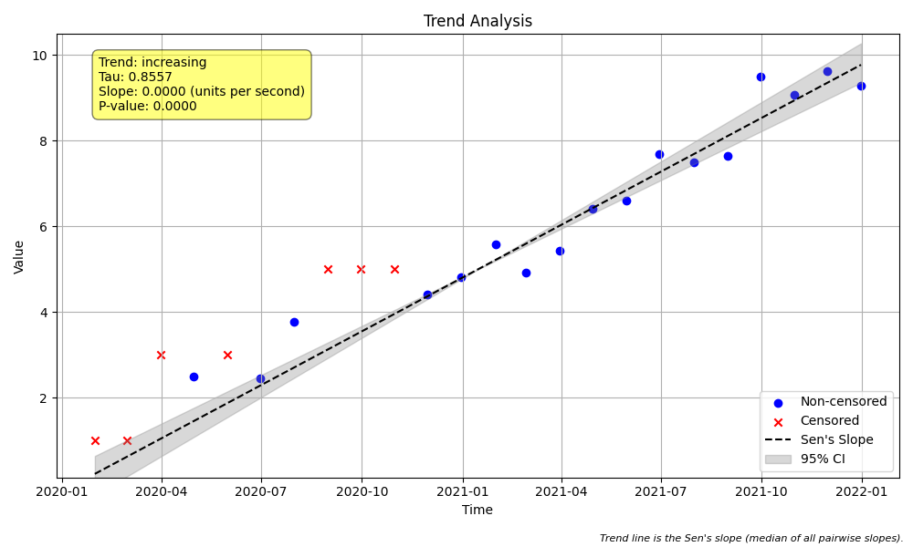
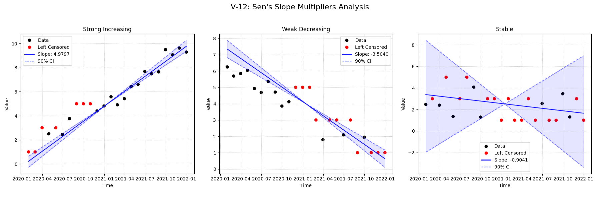

# Validation Report

    # V-12: Sen's Slope Censored Multipliers

    ## Objective
    Isolate and verify the effect of the `lt_mult` and `gt_mult` parameters.
    The test uses data with **multiple censoring levels** (<1, <3, <5) to ensure
    robust validation of multiplier application across different limits.

## Plots
### plot_trend.png

### v12_combined.png

## Results
| Test ID                | Method            |     Slope |     P-Value |   Lower CI |   Upper CI |
|:-----------------------|:------------------|----------:|------------:|-----------:|-----------:|
| V-12_strong_increasing | MannKS (Standard) |  4.97974  | 5.63346e-08 |    4.54482 |   5.50368  |
| V-12_strong_increasing | MannKS (LWP Mode) |  4.73011  | 5.63346e-08 |    4.27997 |   5.19221  |
| V-12_strong_increasing | LWP-TRENDS (R)    |  4.73011  | 5.54381e-08 |    4.36193 |   5.11694  |
| V-12_strong_increasing | MannKS (ATS)      |  4.81425  | 5.63346e-08 |    4.38802 |   5.19857  |
| V-12_strong_increasing | NADA2 (R)         |  4.80816  | 5.54381e-08 |  nan       | nan        |
| V-12_weak_decreasing   | MannKS (Standard) | -3.50399  | 2.82894e-05 |   -4.05878 |  -2.95232  |
| V-12_weak_decreasing   | MannKS (LWP Mode) | -2.89828  | 2.82894e-05 |   -3.42588 |   0        |
| V-12_weak_decreasing   | LWP-TRENDS (R)    | -2.89828  | 2.61466e-05 |   -3.31932 |  -1.48264  |
| V-12_weak_decreasing   | MannKS (ATS)      | -3.15586  | 2.82894e-05 |   -3.55158 |  -2.70136  |
| V-12_weak_decreasing   | NADA2 (R)         | -3.16369  | 2.61466e-05 |  nan       | nan        |
| V-12_stable            | MannKS (Standard) | -0.904107 | 0.545468    |   -6.16273 |   4.67663  |
| V-12_stable            | MannKS (LWP Mode) |  0        | 0.545468    |    0       |   0        |
| V-12_stable            | LWP-TRENDS (R)    |  0        | 0.534439    |    0       |   0        |
| V-12_stable            | MannKS (ATS)      | -0.669911 | 0.545468    |   -2.18733 |   0.871757 |
| V-12_stable            | NADA2 (R)         | -0.670698 | 0.534439    |  nan       | nan        |

## LWP Accuracy (Python vs R)
| Test ID                |   Slope Error |   Slope % Error |
|:-----------------------|--------------:|----------------:|
| V-12_strong_increasing |   0           |     0           |
| V-12_weak_decreasing   |   4.44089e-16 |     1.53225e-14 |
| V-12_stable            | nan           |   nan           |
