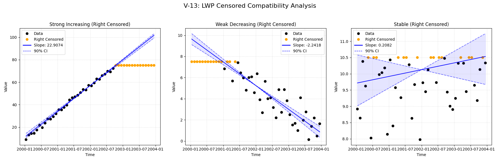
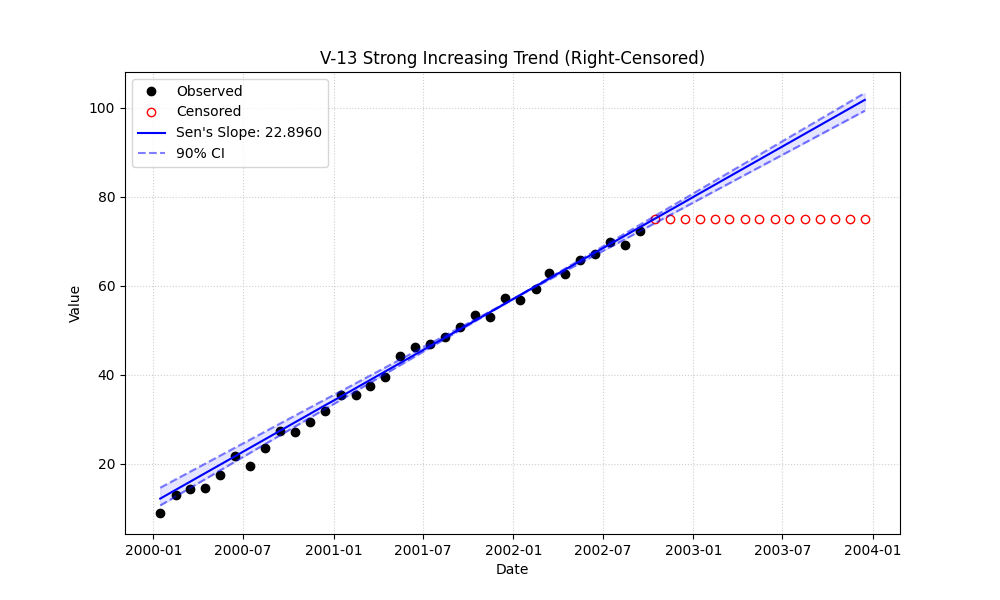

# Validation Report

# Validation Case V-13: Censored LWP Compatibility Modes

This validation case focuses on verifying the "LWP Compatibility Mode" of the `MannKS` package against the original LWP-TRENDS R script, specifically for **right-censored** data.

The goal is to demonstrate that setting parameters `mk_test_method='lwp'` and `sens_slope_method='lwp'` allows Python to accurately replicate the R script's handling of censored values.

## Methodology
- **Data:** 4 years of monthly data (n=48).
- **Censoring:** Approximately 30% of data is **right-censored** (values above a threshold are marked as `>Threshold`).

## Plots
### v13_combined.png

### v13_strong.png

## Results
| Test ID                | Method            |       Slope |     P-Value |   Lower CI |   Upper CI |
|:-----------------------|:------------------|------------:|------------:|-----------:|-----------:|
| V-13_strong_increasing | MannKS (Standard) | 22.9074     | 2.9883e-06  |  21.6688   |  23.6676   |
| V-13_strong_increasing | MannKS (LWP Mode) | 22.33       | 0           |  20.8154   |  23.3544   |
| V-13_strong_increasing | LWP-TRENDS (R)    | 22.33       | 8.45076e-20 |  21.1505   |  23.1862   |
| V-13_strong_increasing | MannKS (ATS)      | 23.8168     | 2.9883e-06  |  23.4563   |  24.1855   |
| V-13_strong_increasing | NADA2 (R)         | 20.2302     | 2.03485e-06 | nan        | nan        |
| V-13_weak_decreasing   | MannKS (Standard) | -2.24182    | 0.00157798  |  -2.50503  |  -1.97335  |
| V-13_weak_decreasing   | MannKS (LWP Mode) | -2.09662    | 1.23901e-13 |  -2.37583  |  -1.8181   |
| V-13_weak_decreasing   | LWP-TRENDS (R)    | -2.09662    | 4.87761e-14 |  -2.32917  |  -1.8704   |
| V-13_weak_decreasing   | MannKS (ATS)      | -2.51137    | 0.00157798  |  -2.8169   |  -2.20772  |
| V-13_weak_decreasing   | NADA2 (R)         | -1.52312    | 0.00131394  | nan        | nan        |
| V-13_stable            | MannKS (Standard) |  0.208187   | 0.517917    |  -0.231607 |   0.567539 |
| V-13_stable            | MannKS (LWP Mode) |  0.00929474 | 0.32823     |  -0.011928 |   0.42914  |
| V-13_stable            | LWP-TRENDS (R)    |  0.00929474 | 0.320298    |   0        |   0.355311 |
| V-13_stable            | MannKS (ATS)      |  0.132807   | 0.517917    |  -0.139913 |   0.397254 |
| V-13_stable            | NADA2 (R)         |  0.0712456  | 0.510925    | nan        | nan        |

## LWP Accuracy (Python vs R)
| Test ID                |   Slope Error |   Slope % Error |
|:-----------------------|--------------:|----------------:|
| V-13_strong_increasing |   0           |     0           |
| V-13_weak_decreasing   |   4.44089e-16 |    -2.22045e-13 |
| V-13_stable            |   1.73472e-18 |     1.86635e-14 |
