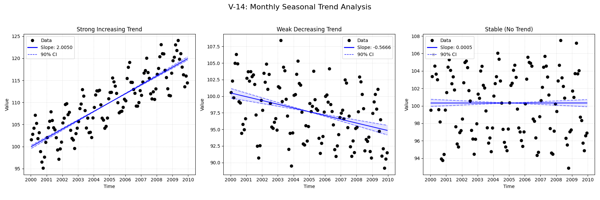

# Validation Report

**V-14: Monthly Seasonal Trend**

This test verifies the seasonal trend analysis functionality on a simple monthly dataset.
It compares the standard `MannKS` seasonal test against the LWP-TRENDS R script and NADA2.

**Scenarios:**
1.  **Strong Increasing:** Clear positive trend with seasonality.
2.  **Weak Decreasing:** Subtle negative trend with seasonality.
3.  **Stable:** No underlying trend, just seasonality.

## Plots
### V14_Trend_Analysis.png

## Results
               Test ID            Method     Slope      P-Value  Lower CI  Upper CI
V-14_strong_increasing MannKS (Standard)  2.020856 0.000000e+00  1.972572  2.080038
V-14_strong_increasing MannKS (LWP Mode)  2.020856 0.000000e+00  1.972590  2.079749
V-14_strong_increasing    LWP-TRENDS (R)  2.020856 2.989998e-41  1.976889  2.060802
V-14_strong_increasing      MannKS (ATS)  2.021197 0.000000e+00  2.003043  2.042048
V-14_strong_increasing         NADA2 (R)  1.952000 2.000000e-03       NaN       NaN
  V-14_weak_decreasing MannKS (Standard) -0.466957 1.283174e-10 -0.614060 -0.333050
  V-14_weak_decreasing MannKS (LWP Mode) -0.466957 1.283174e-10 -0.613986 -0.333163
  V-14_weak_decreasing    LWP-TRENDS (R) -0.466957 1.283175e-10 -0.604165 -0.354746
  V-14_weak_decreasing      MannKS (ATS) -0.467963 1.283174e-10 -0.519880 -0.424349
  V-14_weak_decreasing         NADA2 (R) -0.583700 2.000000e-03       NaN       NaN
           V-14_stable MannKS (Standard) -0.010241 7.371284e-01 -0.057873  0.061899
           V-14_stable MannKS (LWP Mode) -0.010241 7.371284e-01 -0.057872  0.061747
           V-14_stable    LWP-TRENDS (R) -0.010241 7.371284e-01 -0.050500  0.049343
           V-14_stable      MannKS (ATS) -0.010159 7.371284e-01 -0.018903  0.007328
           V-14_stable         NADA2 (R) -0.092590 7.140000e-01       NaN       NaN

## LWP Accuracy (Python vs R)
               Test ID   Slope Error  Slope % Error
V-14_strong_increasing  0.000000e+00   0.000000e+00
  V-14_weak_decreasing -5.551115e-17   1.110223e-14
           V-14_stable -1.734723e-18   1.693831e-14
