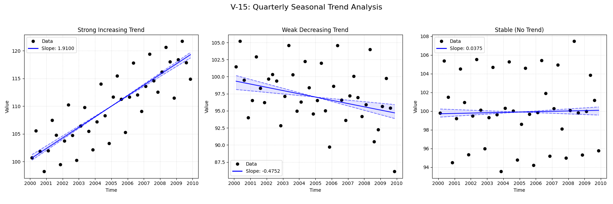

# Validation Report

**V-15: Quarterly Seasonal Data**

This test verifies the seasonal trend analysis functionality on a quarterly dataset.
It compares the standard `mannkensen` seasonal test against the LWP-TRENDS R script and NADA2.

## Plots
### V15_Quarterly_Analysis.png

## Results
| Test ID                | Method                |      Slope |     P-Value |    Lower CI |    Upper CI |
|:-----------------------|:----------------------|-----------:|------------:|------------:|------------:|
| V-15_strong_increasing | MannKenSen (Standard) |  1.91004   | 4.08562e-14 |   1.78935   |   1.99403   |
| V-15_strong_increasing | MannKenSen (LWP Mode) |  1.91004   | 4.08562e-14 |   1.79008   |   1.99384   |
| V-15_strong_increasing | LWP-TRENDS (R)        |  1.91004   | 4.09598e-14 |   1.81703   |   1.98517   |
| V-15_strong_increasing | MannKenSen (ATS)      |  1.91394   | 4.08562e-14 |   1.82813   |   1.99116   |
| V-15_strong_increasing | NADA2 (R)             |  1.875     | 0.002       | nan         | nan         |
| V-15_weak_decreasing   | MannKenSen (Standard) | -0.475203  | 9.99314e-05 |  -0.644613  |  -0.22604   |
| V-15_weak_decreasing   | MannKenSen (LWP Mode) | -0.475203  | 9.99314e-05 |  -0.644464  |  -0.226053  |
| V-15_weak_decreasing   | LWP-TRENDS (R)        | -0.475203  | 9.99314e-05 |  -0.614886  |  -0.244627  |
| V-15_weak_decreasing   | MannKenSen (ATS)      | -0.475202  | 9.99314e-05 |  -0.646008  |  -0.331328  |
| V-15_weak_decreasing   | NADA2 (R)             | -0.5605    | 0.002       | nan         | nan         |
| V-15_stable            | MannKenSen (Standard) |  0.0374604 | 0.560986    |  -0.0661392 |   0.110834  |
| V-15_stable            | MannKenSen (LWP Mode) |  0.0374604 | 0.560986    |  -0.0657506 |   0.110107  |
| V-15_stable            | LWP-TRENDS (R)        |  0.0374604 | 0.560986    |  -0.0576529 |   0.0939143 |
| V-15_stable            | MannKenSen (ATS)      |  0.0383903 | 0.560986    |  -0.023494  |   0.0908254 |
| V-15_stable            | NADA2 (R)             | -0.009769  | 0.582       | nan         | nan         |

## LWP Accuracy (Python vs R)
| Test ID                |   Slope Error |   Slope % Error |
|:-----------------------|--------------:|----------------:|
| V-15_strong_increasing |   2.22045e-16 |     1.11022e-14 |
| V-15_weak_decreasing   |   0           |    -0           |
| V-15_stable            |   0           |     0           |
