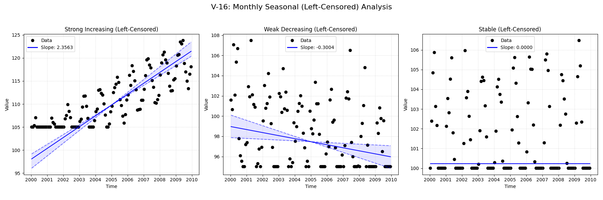

# Validation Report

**V-16: Monthly Seasonal with Left-Censoring**

This test verifies the seasonal trend analysis functionality on a monthly dataset with left-censored values.
It compares the standard `mannkensen` seasonal test against the LWP-TRENDS R script and NADA2.
This test is critical for ensuring that censored data handling works correctly in a seasonal context.

**Scenarios:**
1.  **Strong Increasing:** Clear positive trend with seasonality and left-censoring.
2.  **Weak Decreasing:** Subtle negative trend with seasonality and left-censoring.
3.  **Stable:** No underlying trend, just seasonality and left-censoring.

## Plots
### V16_Censored_Trend_Analysis.png

## Results
               Test ID                Method         Slope       P-Value      Lower CI      Upper CI
V-16_strong_increasing MannKenSen (Standard)  2.356309e+00  0.000000e+00  2.136217e+00  2.764371e+00
V-16_strong_increasing MannKenSen (LWP Mode)  2.356309e+00  0.000000e+00  2.135343e+00  2.764511e+00
V-16_strong_increasing        LWP-TRENDS (R)  2.356309e+00  5.312946e-38  2.161094e+00  2.593465e+00
V-16_strong_increasing      MannKenSen (ATS)  2.014428e+00  0.000000e+00  1.995157e+00  2.030983e+00
V-16_strong_increasing             NADA2 (R)  1.988000e+00  2.000000e-03           NaN           NaN
  V-16_weak_decreasing MannKenSen (Standard) -3.003772e-01  2.952996e-08 -5.291554e-01 -8.080087e-02
  V-16_weak_decreasing MannKenSen (LWP Mode) -3.003772e-01  2.952996e-08 -5.265816e-01 -8.314368e-02
  V-16_weak_decreasing        LWP-TRENDS (R) -3.003772e-01  1.866111e-09 -4.746958e-01 -1.378497e-01
  V-16_weak_decreasing      MannKenSen (ATS) -4.517340e-01  2.952996e-08 -4.942202e-01 -3.862337e-01
  V-16_weak_decreasing             NADA2 (R) -6.227000e-01  2.000000e-03           NaN           NaN
           V-16_stable MannKenSen (Standard)  0.000000e+00  9.101720e-01  0.000000e+00  0.000000e+00
           V-16_stable MannKenSen (LWP Mode)  0.000000e+00  9.101720e-01  0.000000e+00  0.000000e+00
           V-16_stable        LWP-TRENDS (R) -2.147484e+09 -2.147484e+09 -2.147484e+09 -2.147484e+09
           V-16_stable      MannKenSen (ATS)  1.882015e-02  9.101720e-01 -2.183683e-02  5.732571e-02
           V-16_stable             NADA2 (R) -1.310000e-01           NaN           NaN           NaN

## LWP Accuracy (Python vs R)
               Test ID  Slope Error  Slope % Error
V-16_strong_increasing 4.440892e-16   2.220446e-14
  V-16_weak_decreasing 0.000000e+00  -0.000000e+00
           V-16_stable 2.147484e+09  -1.000000e+02
