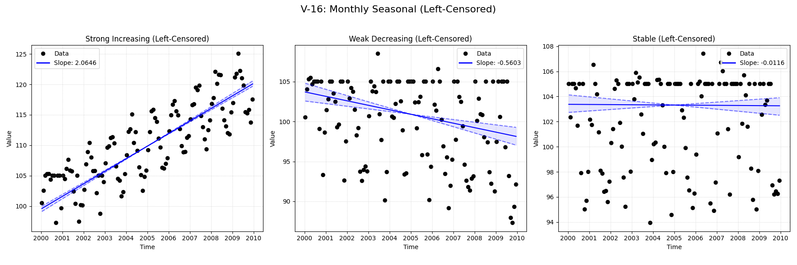

# Validation Report

**V-16: Monthly Seasonal with Left-Censoring**

This test verifies the seasonal trend analysis functionality on a monthly dataset containing left-censored values (e.g., '<5').
It compares the standard `MannKS` seasonal test against the LWP-TRENDS R script and NADA2.

## Plots
### V16_Censored_Seasonal_Analysis.png

## Results
| Test ID                | Method            |      Slope |     P-Value |    Lower CI |     Upper CI |
|:-----------------------|:------------------|-----------:|------------:|------------:|-------------:|
| V-16_strong_increasing | MannKS (Standard) |  2.06461   | 0           |   1.98618   |   2.16197    |
| V-16_strong_increasing | MannKS (LWP Mode) |  2.03891   | 0           |   1.96602   |   2.12961    |
| V-16_strong_increasing | LWP-TRENDS (R)    |  2.03891   | 1.03219e-39 |   1.97724   |   2.11899    |
| V-16_strong_increasing | MannKS (ATS)      |  2.01141   | 0           |   1.98294   |   2.0349     |
| V-16_strong_increasing | NADA2 (R)         |  1.909     | 0.002       | nan         | nan          |
| V-16_weak_decreasing   | MannKS (Standard) | -0.560275  | 3.30807e-05 |  -0.780844  |  -0.332092   |
| V-16_weak_decreasing   | MannKS (LWP Mode) |  0         | 3.30807e-05 |   0         |   0          |
| V-16_weak_decreasing   | LWP-TRENDS (R)    |  0         | 2.649e-05   |   0         |   0          |
| V-16_weak_decreasing   | MannKS (ATS)      | -0.533913  | 3.30807e-05 |  -0.568677  |  -0.498817   |
| V-16_weak_decreasing   | NADA2 (R)         | -0.6739    | 0.002       | nan         | nan          |
| V-16_stable            | MannKS (Standard) | -0.0116023 | 0.775985    |  -0.16316   |   0.118042   |
| V-16_stable            | MannKS (LWP Mode) |  0         | 0.775985    |   0         |   0          |
| V-16_stable            | LWP-TRENDS (R)    |  0         | 0.769762    |   0         |   0          |
| V-16_stable            | MannKS (ATS)      | -0.0116023 | 0.775985    |  -0.0267186 |   0.00797585 |
| V-16_stable            | NADA2 (R)         | -0.1144    | 0.698       | nan         | nan          |

## LWP Accuracy (Python vs R)
| Test ID                |   Slope Error |   Slope % Error |
|:-----------------------|--------------:|----------------:|
| V-16_strong_increasing |             0 |               0 |
| V-16_weak_decreasing   |             0 |              -0 |
| V-16_stable            |             0 |               0 |
