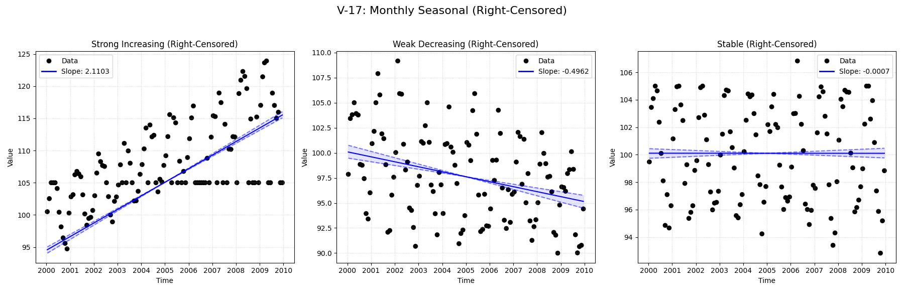

# Validation Report

**V-17: Monthly Seasonal with Right-Censoring**

This test verifies the seasonal trend analysis functionality on a monthly dataset containing right-censored values (e.g., '>100').
It compares the standard `MannKS` seasonal test against the LWP-TRENDS R script and NADA2.

## Plots
### V17_Right_Censored_Seasonal_Analysis.png

## Results
| Test ID                | Method            |        Slope |     P-Value |    Lower CI |    Upper CI |
|:-----------------------|:------------------|-------------:|------------:|------------:|------------:|
| V-17_strong_increasing | MannKS (Standard) |  2.11034     | 4.72955e-14 |   2.0215    |   2.21753   |
| V-17_strong_increasing | MannKS (LWP Mode) |  1.85398     | 0           |   1.66916   |   1.97497   |
| V-17_strong_increasing | LWP-TRENDS (R)    |  1.85398     | 1.01389e-19 |   1.71163   |   1.95735   |
| V-17_strong_increasing | MannKS (ATS)      |  2.05381     | 4.72955e-14 |   2.03703   |   2.07335   |
| V-17_strong_increasing | NADA2 (R)         |  1.612       | 0.002       | nan         | nan         |
| V-17_weak_decreasing   | MannKS (Standard) | -0.49618     | 7.06221e-10 |  -0.631693  |  -0.37327   |
| V-17_weak_decreasing   | MannKS (LWP Mode) | -0.489449    | 6.47102e-11 |  -0.62519   |  -0.365866  |
| V-17_weak_decreasing   | LWP-TRENDS (R)    | -0.489449    | 6.47102e-11 |  -0.617886  |  -0.381726  |
| V-17_weak_decreasing   | MannKS (ATS)      | -0.489428    | 7.06221e-10 |  -0.54388   |  -0.440976  |
| V-17_weak_decreasing   | NADA2 (R)         | -0.5096      | 0.002       | nan         | nan         |
| V-17_stable            | MannKS (Standard) | -0.000744849 | 1           |  -0.0676505 |   0.0736209 |
| V-17_stable            | MannKS (LWP Mode) |  0           | 0.979401    |  -0.0624068 |   0.0635692 |
| V-17_stable            | LWP-TRENDS (R)    |  0           | 0.979341    |  -0.0544449 |   0.0554198 |
| V-17_stable            | MannKS (ATS)      | -0.000655656 | 1           |  -0.0169402 |   0.0200376 |
| V-17_stable            | NADA2 (R)         | -0.06716     | 1           | nan         | nan         |

## LWP Accuracy (Python vs R)
| Test ID                |   Slope Error |   Slope % Error |
|:-----------------------|--------------:|----------------:|
| V-17_strong_increasing |             0 |               0 |
| V-17_weak_decreasing   |             0 |              -0 |
| V-17_stable            |             0 |               0 |
