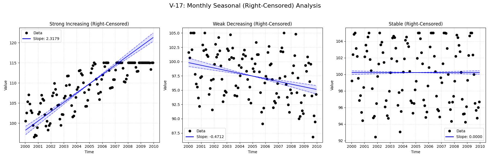

# Validation Report

**V-17: Monthly Seasonal with Right-Censoring**

This test verifies the seasonal trend analysis functionality on a monthly dataset with right-censored values.
It compares the standard `mannkensen` seasonal test against the LWP-TRENDS R script and NADA2.

**Scenarios:**
1.  **Strong Increasing:** Clear positive trend with seasonality and right-censoring.
2.  **Weak Decreasing:** Subtle negative trend with seasonality and right-censoring.
3.  **Stable:** No underlying trend, just seasonality and right-censoring.

## Plots
### V17_Right_Censored_Trend_Analysis.png

## Results
               Test ID                Method     Slope      P-Value  Lower CI  Upper CI
V-17_strong_increasing MannKenSen (Standard)  2.317915 0.000000e+00  2.127139  2.548730
V-17_strong_increasing MannKenSen (LWP Mode)  2.317915 0.000000e+00  2.127180  2.548522
V-17_strong_increasing        LWP-TRENDS (R)  2.317915 2.226610e-37  2.158624  2.465284
V-17_strong_increasing      MannKenSen (ATS)  2.029328 0.000000e+00  2.014514  2.042087
V-17_strong_increasing             NADA2 (R)  1.164000 2.000000e-03       NaN       NaN
  V-17_weak_decreasing MannKenSen (Standard) -0.471243 1.520217e-10 -0.633007 -0.335532
  V-17_weak_decreasing MannKenSen (LWP Mode) -0.471243 1.520217e-10 -0.632533 -0.335541
  V-17_weak_decreasing        LWP-TRENDS (R) -0.471243 1.499088e-10 -0.610724 -0.355650
  V-17_weak_decreasing      MannKenSen (ATS) -0.458952 1.520217e-10 -0.504306 -0.408723
  V-17_weak_decreasing             NADA2 (R) -0.464100 2.000000e-03       NaN       NaN
           V-17_stable MannKenSen (Standard)  0.000000 7.566836e-01 -0.042695  0.046492
           V-17_stable MannKenSen (LWP Mode)  0.000000 7.566836e-01 -0.042641  0.046292
           V-17_stable        LWP-TRENDS (R)  0.000000 7.543734e-01 -0.035297  0.038180
           V-17_stable      MannKenSen (ATS) -0.009610 7.566836e-01 -0.028589  0.006839
           V-17_stable             NADA2 (R) -0.148600 4.400000e-01       NaN       NaN

## LWP Accuracy (Python vs R)
               Test ID  Slope Error  Slope % Error
V-17_strong_increasing 4.440892e-16   2.220446e-14
  V-17_weak_decreasing 5.551115e-17  -1.110223e-14
           V-17_stable 0.000000e+00   0.000000e+00
