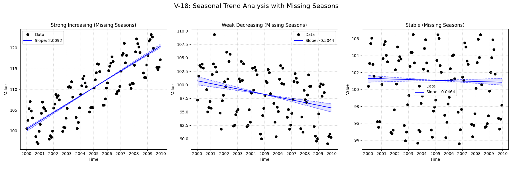

# Validation Report

**V-18: Seasonal Data with Missing Seasons**

This test verifies behavior when entire seasons are missing from the data (e.g., all data for July and August is removed).
It compares the standard `mannkensen` seasonal test against the LWP-TRENDS R script and NADA2.
This test is important because the LWP R script is known to be fragile when entire seasons are missing.

**Scenarios:**
1.  **Strong Increasing:** Clear positive trend, but seasons 7 and 8 are completely missing.
2.  **Weak Decreasing:** Subtle negative trend, seasons 7 and 8 missing.
3.  **Stable:** No trend, seasons 7 and 8 missing.

## Plots
### V18_Missing_Seasons_Trend_Analysis.png

## Results
               Test ID                Method         Slope       P-Value      Lower CI      Upper CI
V-18_strong_increasing MannKenSen (Standard)  2.009240e+00  0.000000e+00  1.945708e+00  2.103445e+00
V-18_strong_increasing MannKenSen (LWP Mode)  2.009240e+00  0.000000e+00  1.945971e+00  2.103323e+00
V-18_strong_increasing        LWP-TRENDS (R) -2.147484e+09 -2.147484e+09 -2.147484e+09 -2.147484e+09
V-18_strong_increasing      MannKenSen (ATS)  2.009473e+00  0.000000e+00  1.975898e+00  2.032401e+00
V-18_strong_increasing             NADA2 (R)  1.977000e+00  2.000000e-03           NaN           NaN
  V-18_weak_decreasing MannKenSen (Standard) -5.044368e-01  4.082930e-10 -6.583496e-01 -3.548369e-01
  V-18_weak_decreasing MannKenSen (LWP Mode) -5.044368e-01  4.082930e-10 -6.551931e-01 -3.562377e-01
  V-18_weak_decreasing        LWP-TRENDS (R) -2.147484e+09 -2.147484e+09 -2.147484e+09 -2.147484e+09
  V-18_weak_decreasing      MannKenSen (ATS) -5.045625e-01  4.082930e-10 -5.495627e-01 -4.473593e-01
  V-18_weak_decreasing             NADA2 (R) -5.652000e-01  2.000000e-03           NaN           NaN
           V-18_stable MannKenSen (Standard) -4.636375e-02  3.506233e-01 -1.147491e-01  4.493558e-02
           V-18_stable MannKenSen (LWP Mode) -4.636375e-02  3.506233e-01 -1.134509e-01  4.472684e-02
           V-18_stable        LWP-TRENDS (R) -2.147484e+09 -2.147484e+09 -2.147484e+09 -2.147484e+09
           V-18_stable      MannKenSen (ATS) -4.662621e-02  3.506233e-01 -6.781009e-02 -1.268504e-02
           V-18_stable             NADA2 (R) -1.062000e-01  3.480000e-01           NaN           NaN

## LWP Accuracy (Python vs R)
               Test ID  Slope Error  Slope % Error
V-18_strong_increasing 2.147484e+09   1.073742e+11
  V-18_weak_decreasing 2.147484e+09  -4.294967e+11
           V-18_stable 2.147484e+09  -1.000000e+02
