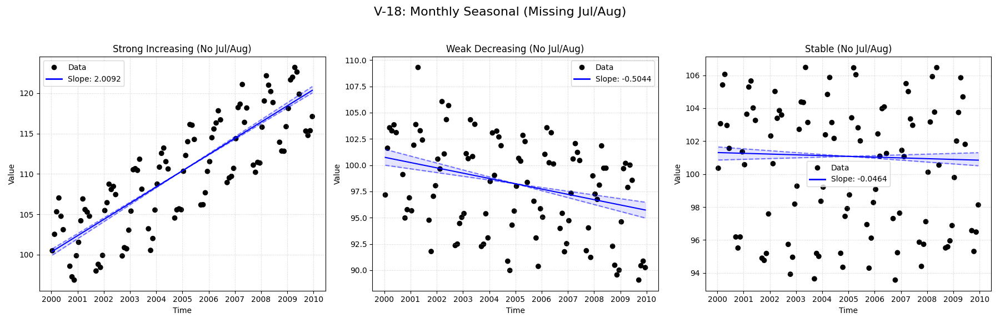

# Validation Report

**V-18: Seasonal Data with Missing Seasons**

This test verifies the seasonal trend analysis when entire seasons are missing from the dataset.
Specifically, all data for **July (Month 7)** and **August (Month 8)** will be removed.
This forces the test to skip these seasons and only analyze the remaining 10 months.

**Note:** The LWP-TRENDS R script has a known fragility with missing seasons and may fail to run.
The `MannKS` package is expected to handle this gracefully by skipping the missing seasons and analyzing the rest.

**R Workaround:** To verify if the LWP R script *can* run if the data is massaged, this validation
script also runs a "Patched" version where missing seasons are filled with `NA` values to ensure
a complete Year x Month grid. This confirms that the R failure is structural, not statistical.

## Plots
### V18_Missing_Seasons_Analysis.png

## Results
| Test ID                | Method                   |       Slope |       P-Value |    Lower CI |    Upper CI |
|:-----------------------|:-------------------------|------------:|--------------:|------------:|------------:|
| V-18_strong_increasing | MannKS (Standard)        |   2.00924   |   0           |   1.94571   |   2.10345   |
| V-18_strong_increasing | MannKS (LWP Mode)        |   2.00924   |   0           |   1.94597   |   2.10332   |
| V-18_strong_increasing | LWP-TRENDS (R)           | nan         | nan           | nan         | nan         |
| V-18_strong_increasing | LWP-TRENDS (R) [Patched] |   2.0201    |   1.4851e-41  |   1.97773   |   2.0862    |
| V-18_strong_increasing | MannKS (ATS)             |   2.00947   |   0           |   1.98829   |   2.02837   |
| V-18_strong_increasing | NADA2 (R)                |   1.977     |   0.002       | nan         | nan         |
| V-18_weak_decreasing   | MannKS (Standard)        |  -0.504437  |   4.08293e-10 |  -0.65835   |  -0.354837  |
| V-18_weak_decreasing   | MannKS (LWP Mode)        |  -0.504437  |   4.08293e-10 |  -0.655193  |  -0.356238  |
| V-18_weak_decreasing   | LWP-TRENDS (R)           | nan         | nan           | nan         | nan         |
| V-18_weak_decreasing   | LWP-TRENDS (R) [Patched] |  -0.533662  |   5.75286e-14 |  -0.623849  |  -0.431508  |
| V-18_weak_decreasing   | MannKS (ATS)             |  -0.504562  |   4.08293e-10 |  -0.551786  |  -0.447915  |
| V-18_weak_decreasing   | NADA2 (R)                |  -0.5652    |   0.002       | nan         | nan         |
| V-18_stable            | MannKS (Standard)        |  -0.0463638 |   0.350623    |  -0.114749  |   0.0449356 |
| V-18_stable            | MannKS (LWP Mode)        |  -0.0463638 |   0.350623    |  -0.113451  |   0.0447268 |
| V-18_stable            | LWP-TRENDS (R)           | nan         | nan           | nan         | nan         |
| V-18_stable            | LWP-TRENDS (R) [Patched] |  -0.0371741 |   0.394183    |  -0.0850145 |   0.0275318 |
| V-18_stable            | MannKS (ATS)             |  -0.0466262 |   0.350623    |  -0.079453  |  -0.0153051 |
| V-18_stable            | NADA2 (R)                |  -0.1062    |   0.338       | nan         | nan         |

## LWP Accuracy (Python vs R)
| Test ID                |   Slope Error |   Slope % Error |
|:-----------------------|--------------:|----------------:|
| V-18_strong_increasing |           nan |             nan |
| V-18_weak_decreasing   |           nan |             nan |
| V-18_stable            |           nan |             nan |
