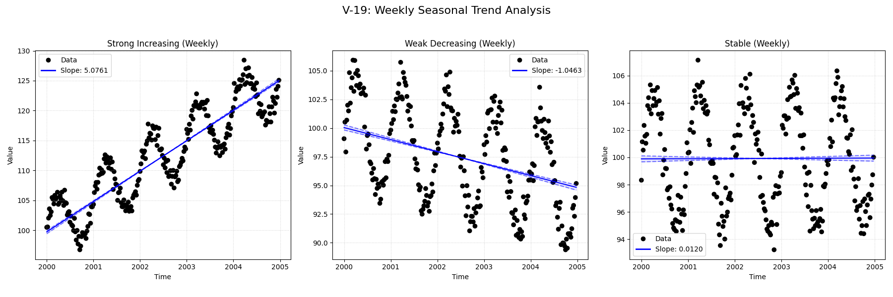

# Validation Report

**V-19: Alternative Seasonal Patterns (season_type='week_of_year')**

This test verifies the handling of 'week_of_year' seasonality.
The data is generated with a weekly frequency and a clear seasonal pattern across the 52 weeks of the year.
This tests the robustness of the datetime handling and the flexibility of the seasonal configuration.

**Scenarios:**
1.  **Strong Increasing:** Clear positive trend with weekly seasonality.
2.  **Weak Decreasing:** Subtle negative trend with weekly seasonality.
3.  **Stable:** No underlying trend, just weekly seasonality.

## Plots
### V19_Alternative_Seasonality.png

## Results
| Test ID                | Method            |       Slope |    P-Value |    Lower CI |    Upper CI |
|:-----------------------|:------------------|------------:|-----------:|------------:|------------:|
| V-19_strong_increasing | MannKS (Standard) |   5.07605   |   0        |   4.99145   |   5.19813   |
| V-19_strong_increasing | MannKS (LWP Mode) |   5.07605   |   0        |   4.99192   |   5.19636   |
| V-19_strong_increasing | LWP-TRENDS (R)    | nan         | nan        | nan         | nan         |
| V-19_strong_increasing | MannKS (ATS)      |   5.07599   |   0        |   5.07599   |   5.07599   |
| V-19_strong_increasing | NADA2 (R)         |   4.709     |   0.002    | nan         | nan         |
| V-19_weak_decreasing   | MannKS (Standard) |  -1.04633   |   0        |  -1.14297   |  -0.96167   |
| V-19_weak_decreasing   | MannKS (LWP Mode) |  -1.04633   |   0        |  -1.14193   |  -0.961854  |
| V-19_weak_decreasing   | LWP-TRENDS (R)    | nan         | nan        | nan         | nan         |
| V-19_weak_decreasing   | MannKS (ATS)      |  -1.04703   |   0        |  -1.04703   |  -1.04703   |
| V-19_weak_decreasing   | NADA2 (R)         |  -1.385     |   0.002    | nan         | nan         |
| V-19_stable            | MannKS (Standard) |   0.0120132 |   0.658787 |  -0.0782123 |   0.0992714 |
| V-19_stable            | MannKS (LWP Mode) |   0.0120132 |   0.658787 |  -0.0779516 |   0.0990939 |
| V-19_stable            | LWP-TRENDS (R)    | nan         | nan        | nan         | nan         |
| V-19_stable            | MannKS (ATS)      |   0.0126482 |   0.658787 |   0.0126482 |   0.0126482 |
| V-19_stable            | NADA2 (R)         |  -0.3361    |   0.652    | nan         | nan         |

## LWP Accuracy (Python vs R)
| Test ID                |   Slope Error |   Slope % Error |
|:-----------------------|--------------:|----------------:|
| V-19_strong_increasing |           nan |             nan |
| V-19_weak_decreasing   |           nan |             nan |
| V-19_stable            |           nan |             nan |
