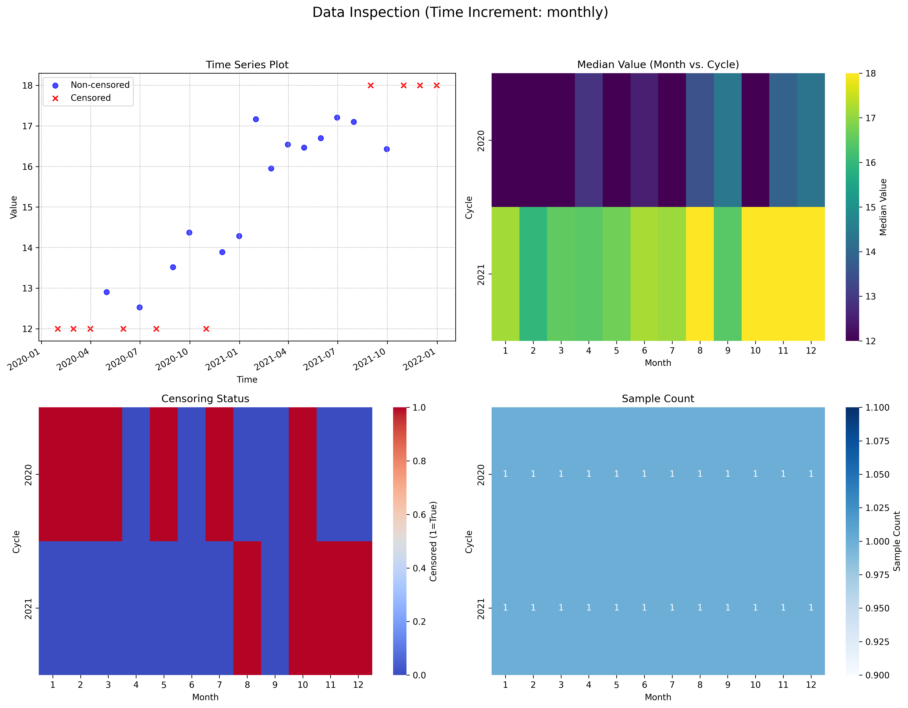

# V-22: Data Inspection Validation

This document validates the `inspect_trend_data` function using a synthetic dataset with mixed censoring.

## 1. Input Data Summary

- Total Points: 24
- Date Range: 2020-01-31 00:00:00 to 2021-12-31 00:00:00
- Censored Values: 9

## 2. Inspection Output (First 5 Rows)

|   value | censored   | cen_type   | date                |   time_increment |
|--------:|:-----------|:-----------|:--------------------|-----------------:|
| 12      | True       | lt         | 2020-01-31 00:00:00 |                1 |
| 12      | True       | lt         | 2020-02-29 00:00:00 |                2 |
| 12      | True       | lt         | 2020-03-31 00:00:00 |                3 |
| 12.8274 | False      | not        | 2020-04-30 00:00:00 |                4 |
| 12      | True       | lt         | 2020-05-31 00:00:00 |                5 |

## 3. Inspection Plot

