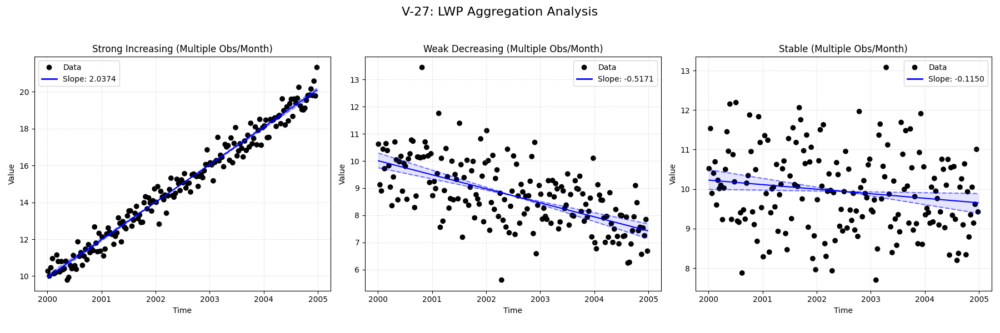

# Validation Report

**V-27: LWP Aggregation (agg_method='lwp')**

This test verifies the LWP-style temporal aggregation behavior.
The dataset contains multiple observations per month. LWP Mode should aggregate these to a single value per month,
matching the behavior of the LWP-TRENDS R script.

**Scenarios:**
1.  **Strong Increasing:** Clear positive trend, multiple points per month.
2.  **Weak Decreasing:** Subtle negative trend, multiple points per month.
3.  **Stable:** No underlying trend, multiple points per month.

## Plots
### V27_LWP_Aggregation.png

## Results
| Test ID                | Method            |      Slope |       P-Value |   Lower CI |    Upper CI |
|:-----------------------|:------------------|-----------:|--------------:|-----------:|------------:|
| V-27_strong_increasing | MannKS (Standard) |   2.03742  |   0           |   1.98781  |   2.07888   |
| V-27_strong_increasing | MannKS (LWP Mode) |   2.04376  |   0           |   1.89659  |   2.10982   |
| V-27_strong_increasing | LWP-TRENDS (R)    |   2.04376  |   3.94336e-17 |   1.93242  |   2.10269   |
| V-27_strong_increasing | MannKS (ATS)      |   2.0374   |   0           |   2.02075  |   2.05602   |
| V-27_strong_increasing | NADA2 (R)         | nan        | nan           | nan        | nan         |
| V-27_weak_decreasing   | MannKS (Standard) |  -0.517081 |   1.77636e-15 |  -0.631757 |  -0.414257  |
| V-27_weak_decreasing   | MannKS (LWP Mode) |  -0.416533 |   4.30278e-06 |  -0.700141 |  -0.278365  |
| V-27_weak_decreasing   | LWP-TRENDS (R)    |  -0.416533 |   4.30278e-06 |  -0.682307 |  -0.29486   |
| V-27_weak_decreasing   | MannKS (ATS)      |  -0.517378 |   1.77636e-15 |  -0.5648   |  -0.47253   |
| V-27_weak_decreasing   | NADA2 (R)         | nan        | nan           | nan        | nan         |
| V-27_stable            | MannKS (Standard) |  -0.114998 |   0.0157661   |  -0.221758 |  -0.0210621 |
| V-27_stable            | MannKS (LWP Mode) |  -0.18532  |   0.00582067  |  -0.495384 |  -0.050464  |
| V-27_stable            | LWP-TRENDS (R)    |  -0.18532  |   0.00582067  |  -0.462333 |  -0.0887001 |
| V-27_stable            | MannKS (ATS)      |  -0.115316 |   0.0157661   |  -0.148219 |  -0.0745529 |
| V-27_stable            | NADA2 (R)         | nan        | nan           | nan        | nan         |

## LWP Accuracy (Python vs R)
| Test ID                |   Slope Error |   Slope % Error |
|:-----------------------|--------------:|----------------:|
| V-27_strong_increasing |  -4.44089e-16 |    -2.22045e-14 |
| V-27_weak_decreasing   |   0           |    -0           |
| V-27_stable            |  -2.77556e-17 |     1.49771e-14 |
