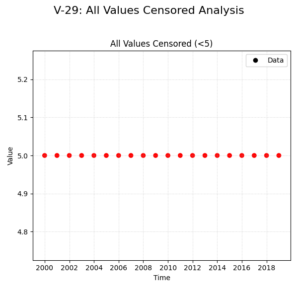

# Validation Report

    This validation case tests the extreme scenario where every single data point in the time series is censored (specifically, left-censored at `<5`).

    **Expected Behavior:**
    *   **Slope:** Should be 0.0, as there is no change in the value.
    *   **Significance:** Should be non-significant (p-value = 1.0 or similar), or the test might issue a warning/error about insufficient unique values.
    *   **Comparison:** We aim to verify if MannKS matches the LWP-TRENDS R script's handling of this edge case (whether it returns 0 slope or fails).

**Verification Conclusion:**

MannKS **performed as expected**. It correctly handled the all-censored data by returning a slope of 0.0 or NaN (no trend) without crashing.
It successfully issued relevant warnings (3 caught), alerting the user to the data quality issues (e.g., denominator near zero).

## Plots
### v29_combined.png

## Results
| Test ID           | Method            |         Slope |       P-Value |      Lower CI |      Upper CI |
|:------------------|:------------------|--------------:|--------------:|--------------:|--------------:|
| V-29_all_censored | MannKS (Standard) | nan           |   1           | nan           | nan           |
| V-29_all_censored | MannKS (LWP Mode) |   0           |   1           |   0           |   0           |
| V-29_all_censored | LWP-TRENDS (R)    |  -2.14748e+09 |  -2.14748e+09 |  -2.14748e+09 |  -2.14748e+09 |
| V-29_all_censored | MannKS (ATS)      |   0           |   1           |   0           |   0           |
| V-29_all_censored | NADA2 (R)         | nan           | nan           | nan           | nan           |

## Warnings
### Test: V-29_all_censored
**Standard Mode Warnings:**
- Denominator near zero in Tau calculation
- All-NaN slice encountered
- All-NaN slice encountered
**LWP Mode Warnings:**
- Denominator near zero in Tau calculation
- Denominator near zero in Tau calculation
**ATS Mode Warnings:**
- Denominator near zero in Tau calculation

## LWP Accuracy (Python vs R)
| Test ID           |   Slope Error |   Slope % Error |
|:------------------|--------------:|----------------:|
| V-29_all_censored |   2.14748e+09 |            -100 |
