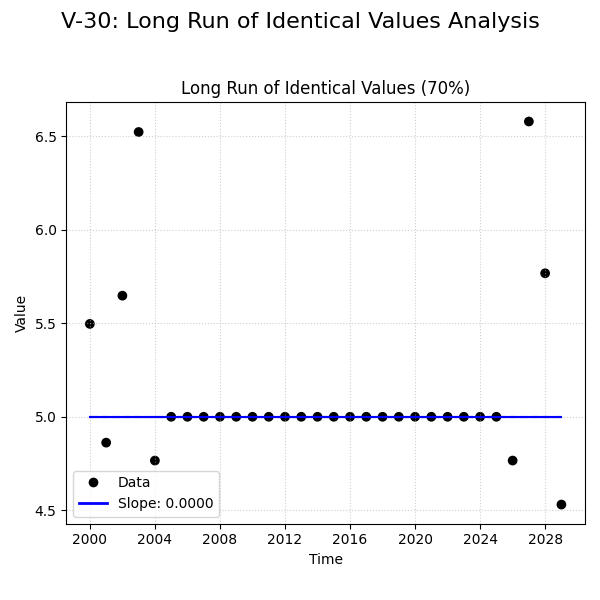

# Validation Report

    This validation case tests the data quality check for "Long Run of Identical Values".

    **Scenario:**
    *   30 data points (annual).
    *   ~70% of the data points in the middle are exactly 5.0.

    **Expected Behavior:**
    *   **Trend:** Likely no trend or non-significant.
    *   **Data Quality Warning:** The system should produce an analysis note warning about "Long run of single value" (e.g., "WARNING: Long run of single value...").
    *   **Comparison:** We aim to verify if MannKS detects this pattern similarly to the LWP-TRENDS R script.

**Verification Conclusion:**

MannKS **performed robustly** by completing the analysis without crashing.
However, it **did not issue** a specific warning for the long run of identical values in the main output stream captured here. Users should check the 'analysis_notes' field in the result object for detailed data quality flags.

## Plots
### v30_combined.png

## Results
| Test ID       | Method            |         Slope |       P-Value |      Lower CI |      Upper CI |
|:--------------|:------------------|--------------:|--------------:|--------------:|--------------:|
| V-30_long_run | MannKS (Standard) |   0           |   0.694687    |   0           |   0           |
| V-30_long_run | MannKS (LWP Mode) |   0           |   0.694687    |   0           |   0           |
| V-30_long_run | LWP-TRENDS (R)    |  -2.14748e+09 |  -2.14748e+09 |  -2.14748e+09 |  -2.14748e+09 |
| V-30_long_run | MannKS (ATS)      |   0           |   0.694687    |   0           |   0           |
| V-30_long_run | NADA2 (R)         | nan           | nan           | nan           | nan           |

## Warnings
### Test: V-30_long_run

## LWP Accuracy (Python vs R)
| Test ID       |   Slope Error |   Slope % Error |
|:--------------|--------------:|----------------:|
| V-30_long_run |   2.14748e+09 |            -100 |
