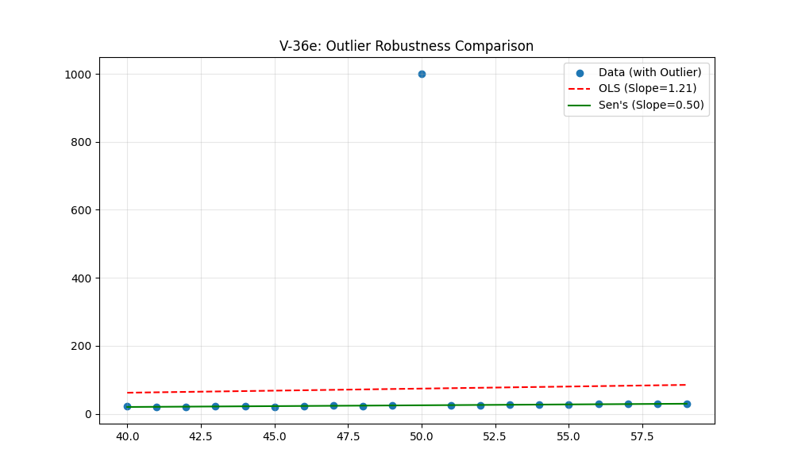
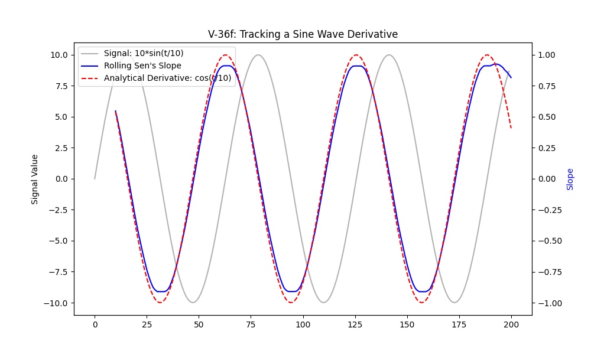

# Validation Report: Rolling Trend Analysis (V-36)

## V-36a: Basic Correctness Check
PASS: Rolling slopes match manual calculation perfectly (Max diff: 0.00e+00)

## V-36b: Interaction with Aggregation
Running rolling trend with daily aggregation on hourly data...
PASS: Successfully computed rolling trends with aggregation (Generated 13 windows)

## V-36c: Interaction with High Censor Rule
PASS: High censor rule rolling test completed without error.

## V-36d: Edge Cases (Small Windows)
PASS: min_size filtering correctly returned empty DataFrame.

## V-36e: Outlier Robustness
Window with outlier (True slope ~0.5)
- OLS Slope: 1.2202
- Sen's Slope: 0.4726
PASS: Sen's slope is more robust to outlier than OLS.

## V-36f: Synthetic Reliability (Sine Wave)
Correlation between rolling Sen's slope and analytical derivative: 0.9954
PASS: Rolling trend accurately tracks changing signal derivative.

