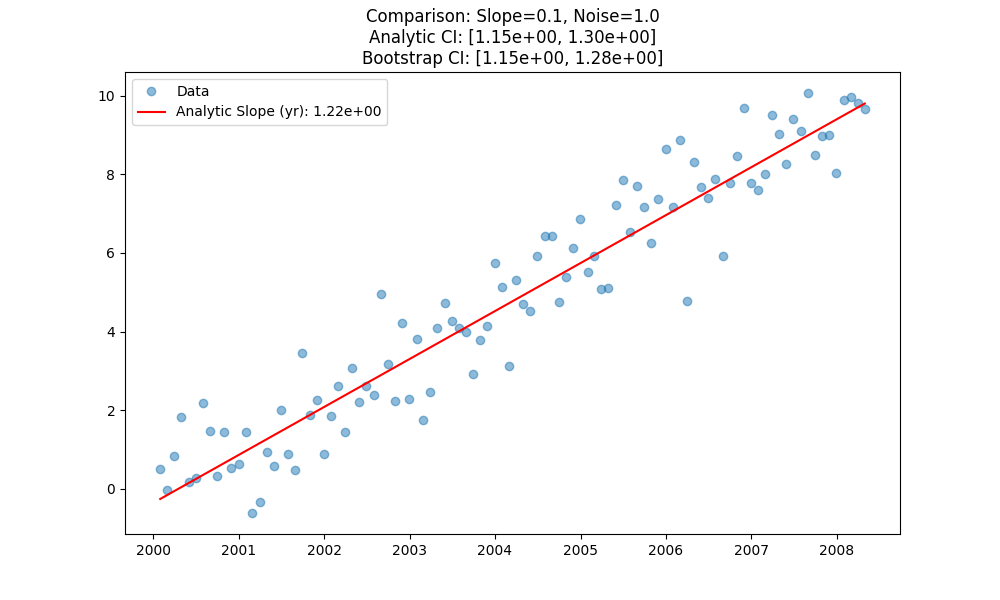
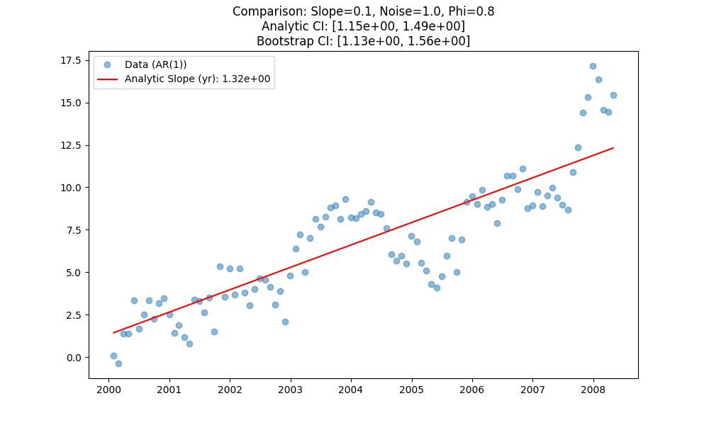

# Validation V-37: Bootstrap CI Comparison

This validation case compares the confidence intervals (CIs) generated by the standard analytic method (assuming independence) against those generated by the block bootstrap method (which accounts for autocorrelation).

**Objective:** Verify that bootstrap CIs are reasonable and consistent with analytic CIs for independent data, while providing a robust alternative.

## 1. Non-Seasonal Trend Test (Independent Data)

**Example Plot (Slope=0.1, Noise=1.0, Phi=0.0):**

## 2. Non-Seasonal Trend Test (AR(1) Autocorrelated Data)

**Example Plot (Slope=0.1, Noise=1.0, Phi=0.8):**

**Results Summary (First 10 rows):**
|    |   slope_param |   noise_param |   autocorr_phi |   analytic_lower |   analytic_upper |   boot_lower |   boot_upper |   analytic_width |   boot_width |
|---:|--------------:|--------------:|---------------:|-----------------:|-----------------:|-------------:|-------------:|-----------------:|-------------:|
|  0 |          0    |           0.5 |              0 |       -0.0260032 |        0.0497312 |   -0.0174319 |    0.0682084 |        0.0757344 |    0.0856403 |
|  1 |          0    |           1   |              0 |       -0.0520063 |        0.0994624 |   -0.0348638 |    0.136417  |        0.151469  |    0.171281  |
|  2 |          0    |           2   |              0 |       -0.104013  |        0.198925  |   -0.0697276 |    0.272834  |        0.302937  |    0.342561  |
|  3 |          0.05 |           0.5 |              0 |        0.57396   |        0.649614  |    0.576985  |    0.678261  |        0.075654  |    0.101276  |
|  4 |          0.05 |           1   |              0 |        0.547956  |        0.699638  |    0.553553  |    0.757491  |        0.151682  |    0.203938  |
|  5 |          0.05 |           2   |              0 |        0.49582   |        0.799101  |    0.508478  |    0.915167  |        0.303281  |    0.406689  |
|  6 |          0.1  |           0.5 |              0 |        1.17384   |        1.25002   |    1.17691   |    1.27772   |        0.0761776 |    0.10081   |
|  7 |          0.1  |           1   |              0 |        1.14792   |        1.29923   |    1.15397   |    1.35652   |        0.151308  |    0.202553  |
|  8 |          0.1  |           2   |              0 |        1.09591   |        1.39928   |    1.10711   |    1.51498   |        0.303364  |    0.407877  |
|  9 |          0.5  |           0.5 |              0 |        5.97407   |        6.04967   |    5.97643   |    6.07782   |        0.0755928 |    0.101394  |

## 3. Seasonal Trend Test

**Example Plot (Slope=0.1, Noise=1.0):**

**Results Summary (First 5 rows):**
|    |   slope_param |   noise_param |   analytic_lower |   analytic_upper |   boot_lower |   boot_upper |   analytic_width |   boot_width |
|---:|--------------:|--------------:|-----------------:|-----------------:|-------------:|-------------:|-----------------:|-------------:|
|  0 |          0    |           0.5 |      -0.0177729  |        0.0540172 |   -0.0234378 |    0.0591507 |        0.07179   |    0.0825885 |
|  1 |          0    |           1   |      -0.0396     |        0.0891183 |   -0.0448782 |    0.0894742 |        0.128718  |    0.134352  |
|  2 |          0    |           2   |       0.00661915 |        0.287371  |    0.0386251 |    0.265997  |        0.280752  |    0.227372  |
|  3 |          0.05 |           0.5 |       0.580141   |        0.644696  |    0.581827  |    0.644079  |        0.0645547 |    0.062252  |
|  4 |          0.05 |           1   |       0.583653   |        0.708121  |    0.598969  |    0.693136  |        0.124468  |    0.0941674 |

## Conclusion
The comparison demonstrates the behavior of bootstrap vs analytic confidence intervals across various slope, noise, and autocorrelation conditions.
