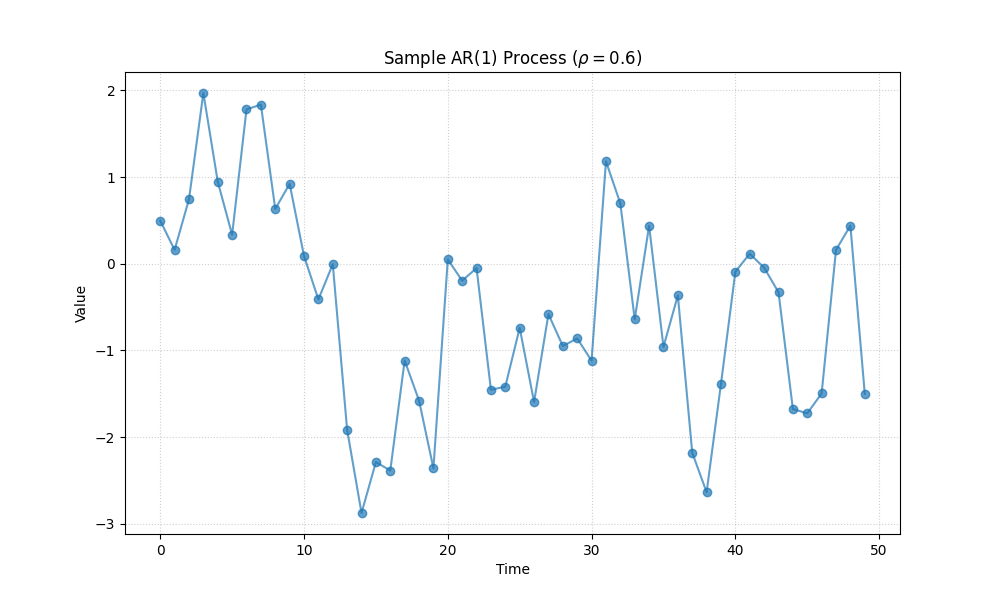

# Validation Case 38: Block Bootstrap for Autocorrelation

This validation case demonstrates the effectiveness of the Block Bootstrap Mann-Kendall test in handling autocorrelated data. Standard Mann-Kendall assumes independence and suffers from inflated Type I error rates (false positives) when positive autocorrelation is present.

## Simulation Setup
- **Data Generation**: AR(1) process with $\rho = 0.6$
- **Sample Size (N)**: 50
- **Simulations**: 500
- **Significance Level ($\alpha$)**: 0.05
- **Null Hypothesis**: No trend (true slope = 0)

## Results
The table below compares the Type I error rates (rejection rates) of the standard Mann-Kendall test versus the Block Bootstrap Mann-Kendall test.

| Method                |   Type I Error Rate |
|:----------------------|--------------------:|
| Standard Mann-Kendall |               0.598 |
| Block Bootstrap MK    |               0.138 |

## Interpretation
With $\rho=0.6$, the standard test rejects H0 approximately 59.8% of the time, which is significantly higher than the nominal 5.0%. The Block Bootstrap method corrects this, bringing the rejection rate down to 13.8%, much closer to the target level.

## Sample Data Plot

