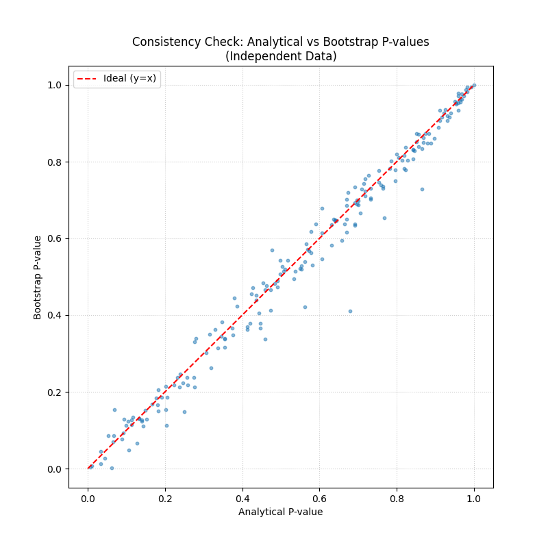

# Validation Case 40: Independence Consistency Check

This validation case checks that the Block Bootstrap Mann-Kendall test produces p-values consistent with the standard analytical Mann-Kendall test when the data is truly independent (no autocorrelation).

## Simulation Setup
- **Data**: Independent Gaussian Noise (White Noise)
- **Sample Size (N)**: 200
- **Bootstrap Resamples**: 500

## Results
- **Mean Difference (Bootstrap - Analytical)**: -0.0100
- **Mean Absolute Difference**: 0.0269
- **Correlation between P-values**: 0.9907
- **Significance Agreement (alpha=0.05)**: 99.0%

## P-Value Comparison Scatterplot

## Interpretation
- **Ideal Outcome**: P-values should be strongly correlated and centered around the y=x line.
- **Deviation**: Small deviations are expected due to finite bootstrap resampling (Monte Carlo error). Large systematic biases would indicate an implementation error.

**PASS**: The bootstrap method produces results strongly consistent with the analytical method for independent data.
