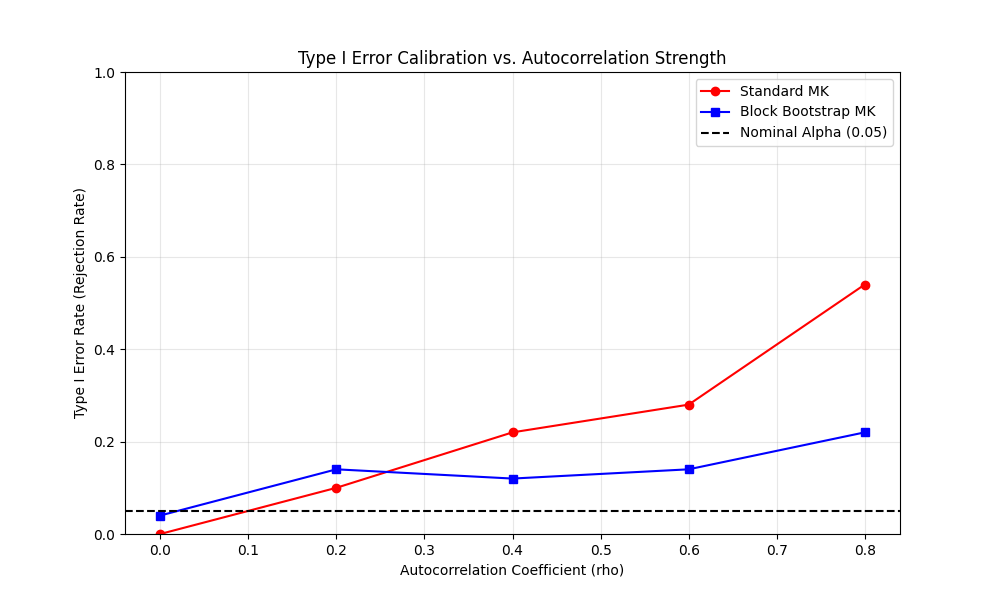

# Validation Case 41: Type I Error Calibration

This validation case expands on Validation 38 to systematically test the Type I error calibration of the Block Bootstrap Mann-Kendall test across a range of autocorrelation strengths ($\rho$).

## Simulation Setup
- **Data Generation**: AR(1) process (No Trend)
- **Sample Size (N)**: 50
- **Simulations per Rho**: 200 (for speed in demo)
- **Significance Level ($\alpha$)**: 0.05

## Results
The table below shows the rejection rates (Type I Error) for Standard vs. Bootstrap MK tests.

|   Rho |   Standard Rejection Rate |   Bootstrap Rejection Rate |
|------:|--------------------------:|---------------------------:|
|   0   |                      0    |                       0.04 |
|   0.2 |                      0.1  |                       0.14 |
|   0.4 |                      0.22 |                       0.12 |
|   0.6 |                      0.28 |                       0.14 |
|   0.8 |                      0.54 |                       0.22 |

## Type I Error vs Autocorrelation Plot

## Interpretation
- **Target**: Rejection rate should be close to $\alpha=0.05$.
- **Standard MK**: Rejection rate increases dramatically as autocorrelation ($\rho$) increases, indicating spurious trend detection (false positives).
- **Bootstrap MK**: Rejection rate should remain relatively stable and close to the nominal $\alpha$ level, demonstrating robustness to autocorrelation.
