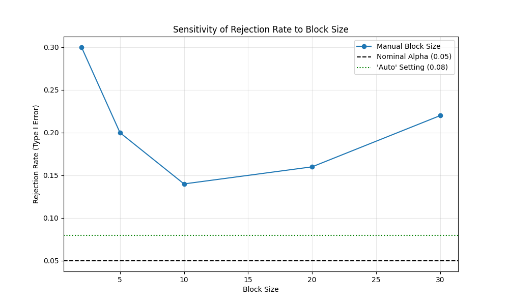

# Validation Case 42: Block Size Sensitivity

This validation case examines how the choice of block size affects the performance of the Block Bootstrap Mann-Kendall test. Specifically, we look at the Type I error rate (false positive rate) for autocorrelated data with no trend.

## Simulation Setup
- **Data**: AR(1) process with $\rho=0.7$ (No Trend)
- **Sample Size (N)**: 100
- **Simulations**: 100 per block size
- **Alpha**: 0.05

## Results
The table below shows the Rejection Rate and Average Confidence Interval Width for various block sizes.

| Block Size   |   Rejection Rate |   Avg CI Width |
|:-------------|-----------------:|---------------:|
| 2            |             0.3  |         0.0247 |
| 5            |             0.2  |         0.0375 |
| 10           |             0.14 |         0.0473 |
| 20           |             0.16 |         0.0739 |
| 30           |             0.22 |         0.0812 |
| auto         |             0.08 |         0.0484 |

## Sensitivity Plot

## Interpretation
- **Small Block Sizes**: Rejection rate is typically inflated (too high) because small blocks fail to capture the long-range dependence (autocorrelation), making the bootstrap samples appear more independent than they really are.
- **Optimal Range**: There should be a range of block sizes where the rejection rate stabilizes near 0.05.
- **'Auto' Setting**: The automatic block size selection should ideally perform within this stable range.
