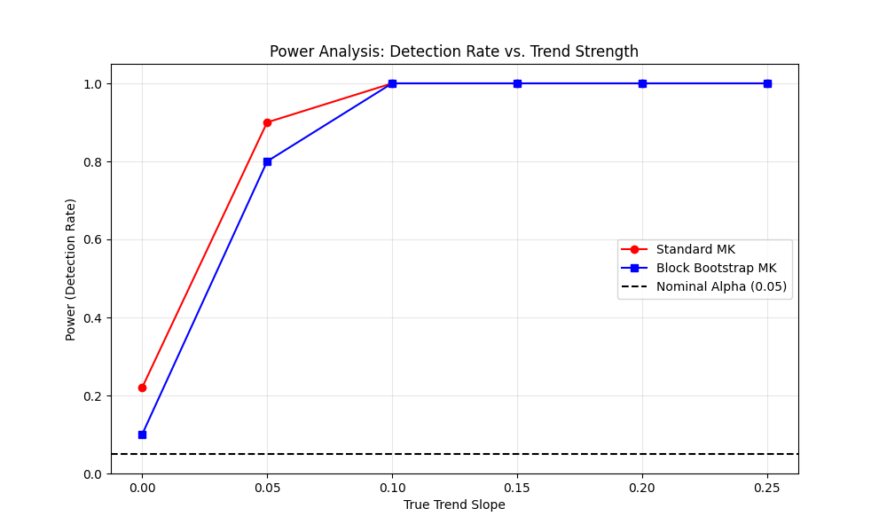

# Validation Case 43: Power Analysis

This validation case examines the statistical power (True Positive Rate) of the Block Bootstrap Mann-Kendall test. Power is the probability of correctly detecting a trend when one actually exists.

## Simulation Setup
- **Data Generation**: AR(1) process with $\rho=0.5$ + Linear Trend
- **Sample Size (N)**: 50
- **Simulations**: 50 per slope (reduced for demo)
- **Alpha**: 0.05

## Results
The table below shows the detection rate (Power) for varying trend slopes.

|   Slope |   Standard Power |   Bootstrap Power |
|--------:|-----------------:|------------------:|
|    0    |             0.22 |               0.1 |
|    0.05 |             0.9  |               0.8 |
|    0.1  |             1    |               1   |
|    0.15 |             1    |               1   |
|    0.2  |             1    |               1   |
|    0.25 |             1    |               1   |

## Power Curve Plot

## Interpretation
- **Corrected vs Uncorrected**: With autocorrelation ($
ho > 0$), the standard MK test has inflated Type I error (high rejection rate at slope=0). This makes its 'power' artificially high because it is biased towards rejection.
- **Bootstrap Performance**: The block bootstrap method should have a lower rejection rate at slope=0 (closer to alpha) but should still exhibit increasing power as the slope magnitude increases, demonstrating its ability to detect real trends while controlling for false positives.
- **Trade-off**: Correcting for autocorrelation inevitably reduces power compared to the (invalid) uncorrected test, but provides a trustworthy statistical inference.
