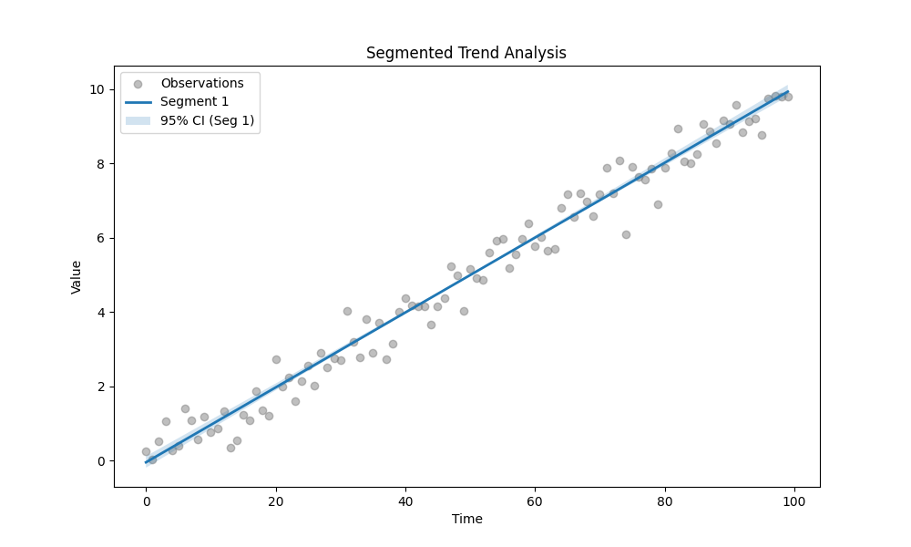
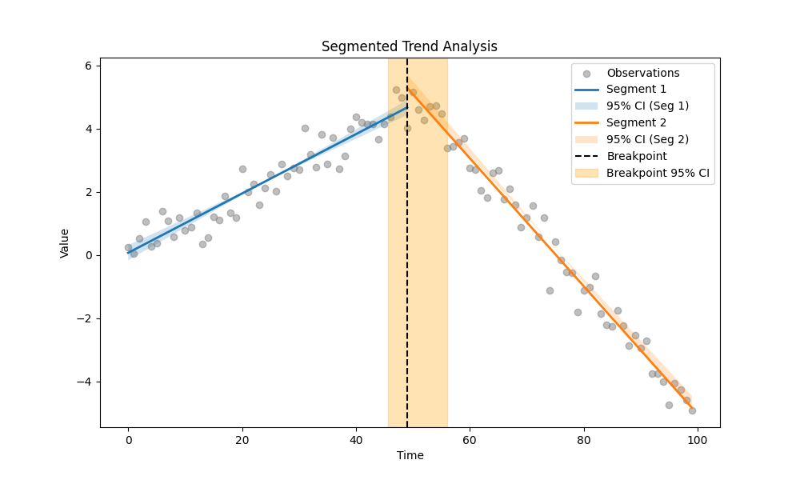
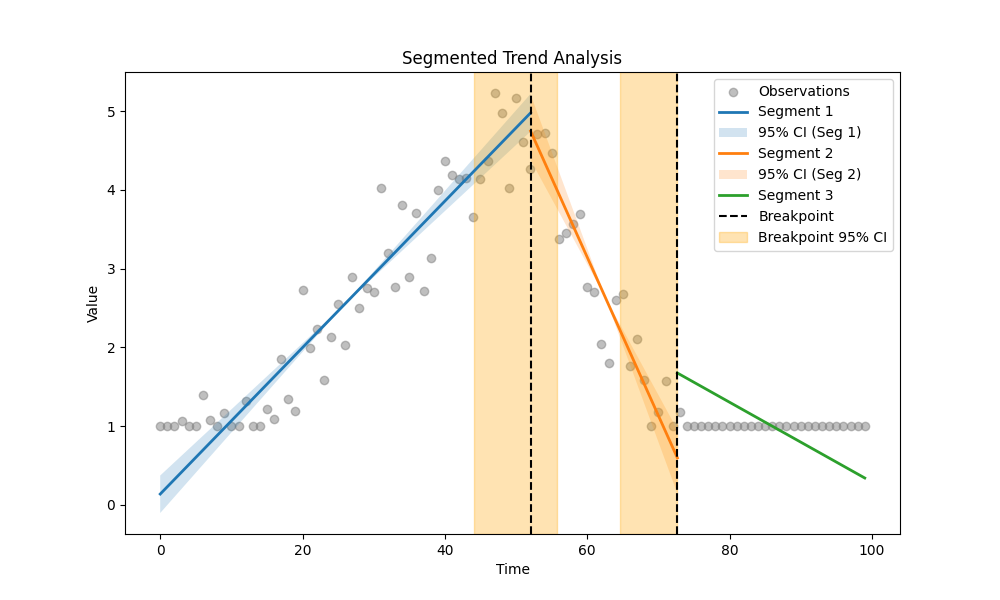
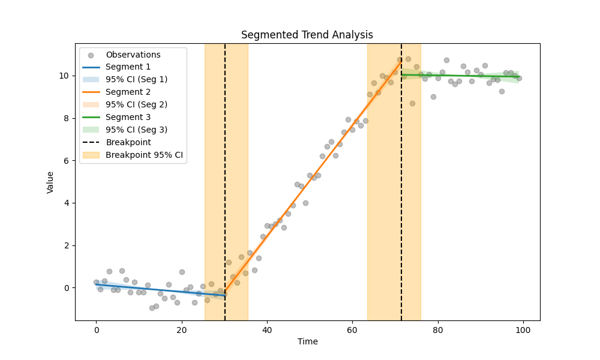

# Validation Report: Segmented Regression

| ID | Description | Success | Result |
|---|---|---|---|
| V-45-01 | No Breakpoint (Linear Trend) | PASS | 0 |
| V-45-02 | Single Hinge Detection (True BP=50) | PASS | 1 |
| V-45-03 | Censored Hinge (Robustness) | PASS | 2 |
| V-45-04 | Double Jump (True BPs=30, 70) | PASS | 2 |
| V-45-05 | Probability Calibration (True BP=50, Window=[45, 55]) | PASS | Probability: 100.00% |

## Detailed Results

### V-45-01: No Breakpoint (Linear Trend)
**Success:** True

#### Model Selection Summary
|   n_breakpoints |      bic |      aic |     sar | converged   |
|----------------:|---------:|---------:|--------:|:------------|
|               0 | -149.888 | -155.098 | 20.3726 | True        |
|               1 | -140.939 | -151.36  | 20.3194 | True        |
|               2 | -139.151 | -154.782 | 18.8659 | True        |

### V-45-02: Single Hinge Detection (True BP=50)
**Success:** True

#### Model Selection Summary
|   n_breakpoints |      bic |      aic |      sar | converged   |
|----------------:|---------:|---------:|---------:|:------------|
|               0 |  166.271 |  161.061 | 480.959  | True        |
|               1 | -143.925 | -154.345 |  19.7217 | True        |
|               2 | -139.243 | -154.874 |  18.8484 | True        |

**Detected Breakpoint:** 51.18134361474203

### V-45-03: Censored Hinge (Robustness)
**Success:** True

#### Model Selection Summary
|   n_breakpoints |       bic |       aic |      sar | converged   |
|----------------:|----------:|----------:|---------:|:------------|
|               0 |   85.8194 |   80.6091 | 215.134  | True        |
|               1 |  -75.8772 |  -86.2979 |  38.9466 | True        |
|               2 | -160.453  | -176.084  |  15.2461 | True        |

### V-45-04: Double Jump (True BPs=30, 70)
**Success:** True

#### Model Selection Summary
|   n_breakpoints |      bic |       aic |      sar | converged   |
|----------------:|---------:|----------:|---------:|:------------|
|               0 |   80.109 |   74.8986 | 203.193  | True        |
|               1 |   59.554 |   49.1333 | 150.883  | True        |
|               2 | -136.662 | -152.293  |  19.3412 | True        |
|               3 | -131.021 | -151.862  |  18.6631 | True        |

### V-45-05: Probability Calibration (True BP=50, Window=[45, 55])
**Success:** True

**Metric:** Probability: 100.00%
