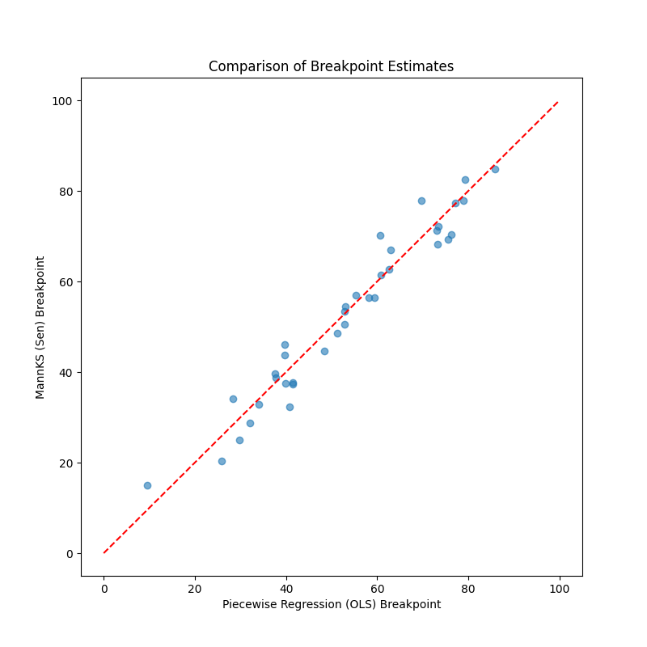

# Validation 46: Comparison with `piecewise-regression`

Comparision across 50 random datasets (Non-censored, Normal noise).

## 1. Model Selection (Number of Breakpoints)
**Match Rate:** 60.0%

### Confusion Matrix (Rows=Piecewise, Cols=MannKS)
|   pw_n |   0 |   1 |   2 |
|-------:|----:|----:|----:|
|      1 |   8 |  24 |   2 |
|      2 |   2 |   8 |   6 |

## 2. Breakpoint Estimation Accuracy
Analyzed 30 matching cases where n > 0.

**Mean Absolute Difference (MannKS vs PW):** 3.6407 units
This measures how close the robust estimator (MannKS) is to the optimal OLS estimator (PW) for normally distributed data.

## 3. Confidence Intervals
**Mean CI Width (Piecewise/OLS):** 13.6136
**Mean CI Width (MannKS/Bootstrap):** 26.8734

Note: OLS CIs assume normality and are asymptotic. MannKS CIs use percentile bootstrap. Differences are expected, but they should be of similar magnitude.
