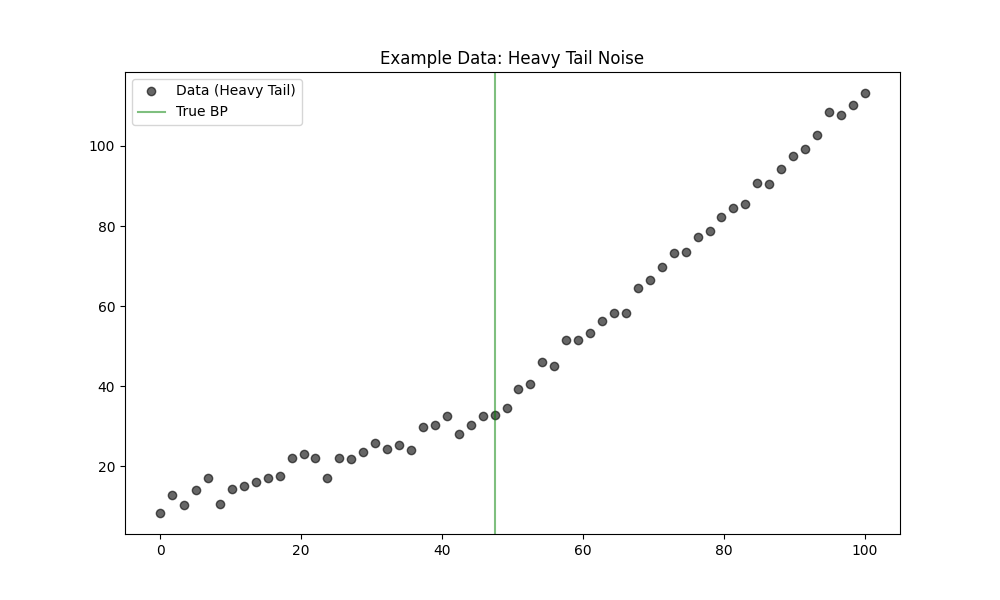

# Validation 47: Heavy Tail Robustness

Comparison of Piecewise (OLS) vs. MannKS (Robust) under **Heavy Tail** noise conditions (t-distribution, df=3).
The True Model has exactly **1 Breakpoint**.

## 1. Detection Accuracy (Finding 1 Breakpoint)
*   **Piecewise (OLS):** 89.5%
*   **MannKS (Standard):** 100.0%
*   **MannKS (Merged):** 100.0%

## 2. Location Precision (MAE)
*   **Piecewise (OLS):** 0.9630
*   **MannKS (Standard):** 0.8384
*   **MannKS (Merged):** 0.8451

## 3. Visual Example

## Analysis
**Result:** MannKS demonstrated superior robustness in this scenario.
