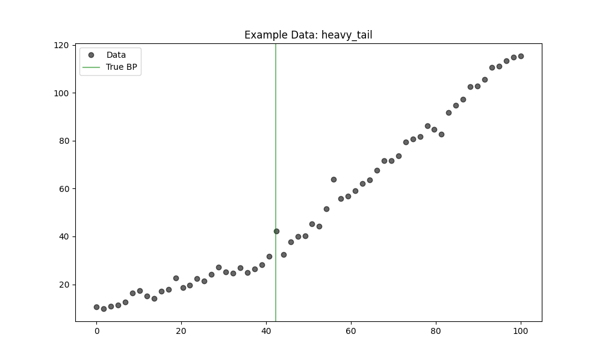
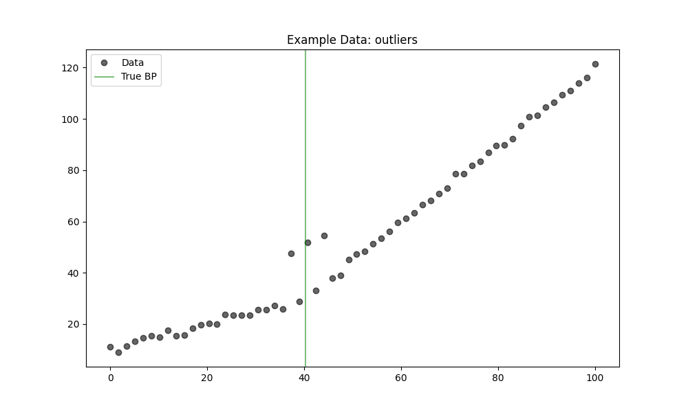
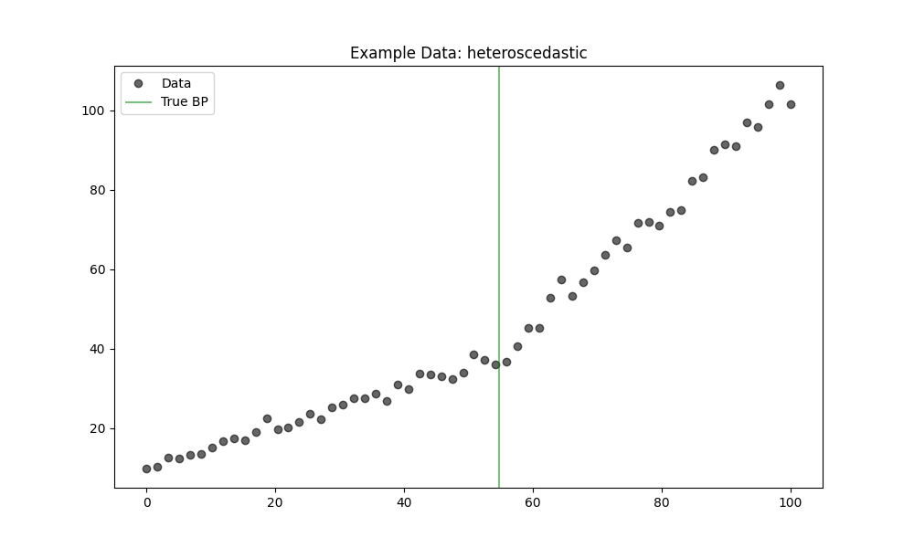

# Validation 47: Robustness Comparison

Comparison of Piecewise (OLS) vs. MannKS (Robust) under difficult conditions.
In all cases, the True Model has exactly **1 Breakpoint**.

## Scenario: Heavy Tail
### 1. Detection Accuracy (Finding 1 Breakpoint)
*   **Piecewise (OLS):** 80.0%
*   **MannKS (Standard):** 100.0%
*   **MannKS (Merged):** 100.0%

### 2. Location Precision (MAE)
*   **Piecewise (OLS):** 0.6186
*   **MannKS (Standard):** 0.4984
*   **MannKS (Merged):** 0.5105

### 3. Visual Example

### Analysis
**Result:** MannKS demonstrated superior robustness in this scenario.

## Scenario: Outliers
### 1. Detection Accuracy (Finding 1 Breakpoint)
*   **Piecewise (OLS):** 60.0%
*   **MannKS (Standard):** 100.0%
*   **MannKS (Merged):** 100.0%

### 2. Location Precision (MAE)
*   **Piecewise (OLS):** 2.9068
*   **MannKS (Standard):** 0.4565
*   **MannKS (Merged):** 0.4603

### 3. Visual Example

### Analysis
**Result:** MannKS demonstrated superior robustness in this scenario.

## Scenario: Heteroscedastic
### 1. Detection Accuracy (Finding 1 Breakpoint)
*   **Piecewise (OLS):** 100.0%
*   **MannKS (Standard):** 100.0%
*   **MannKS (Merged):** 100.0%

### 2. Location Precision (MAE)
*   **Piecewise (OLS):** 0.6156
*   **MannKS (Standard):** 0.7338
*   **MannKS (Merged):** 0.7501

### 3. Visual Example

### Analysis
**Result:** Both methods performed similarly.
