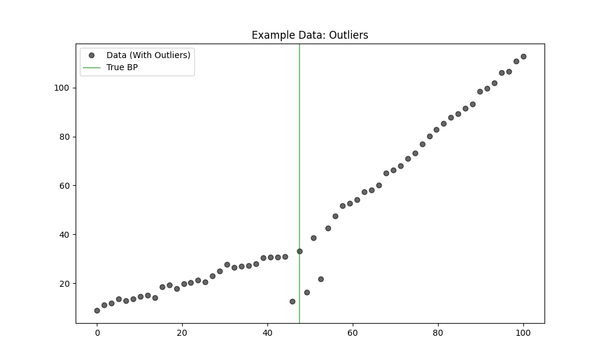

# Validation 48: Outliers Robustness

Comparison of Piecewise (OLS) vs. MannKS (Robust) in the presence of **Extreme Outliers** near the breakpoint.
The True Model has exactly **1 Breakpoint**.

## 1. Detection Accuracy (Finding 1 Breakpoint)
*   **Piecewise (OLS):** 45.0%
*   **MannKS (Standard):** 100.0%
*   **MannKS (Merged):** 100.0%
*   **MannKS (Permutation):** 90.0%

## 2. Location Precision (MAE)
*   **Piecewise (OLS):** 3.2834
*   **MannKS (Standard):** 0.4643
*   **MannKS (Merged):** 0.4700
*   **MannKS (Permutation):** 0.4661

## 3. Visual Example

## Analysis
**Result:** MannKS demonstrated superior robustness in this scenario.
