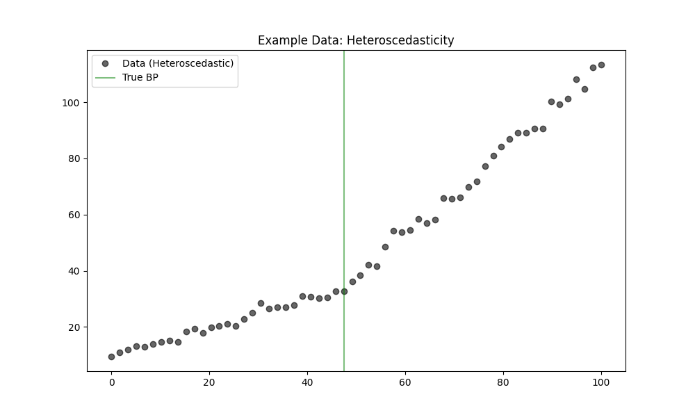

# Validation 49: Heteroscedastic Robustness

Comparison of Piecewise (OLS) vs. MannKS (Robust) under **Heteroscedastic** noise conditions (increasing variance).
The True Model has exactly **1 Breakpoint**.

## 1. Detection Accuracy (Finding 1 Breakpoint)
*   **Piecewise (OLS):** 85.5%
*   **MannKS (Standard):** 100.0%
*   **MannKS (Merged):** 100.0%

## 2. Location Precision (MAE)
*   **Piecewise (OLS):** 0.7613
*   **MannKS (Standard):** 0.8244
*   **MannKS (Merged):** 0.8184

## 3. Visual Example

## Analysis
**Result:** MannKS demonstrated superior robustness in this scenario.
