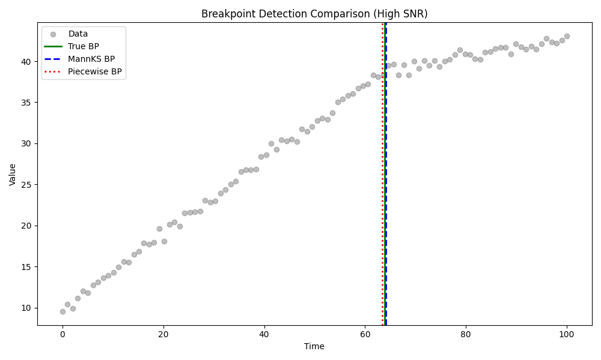
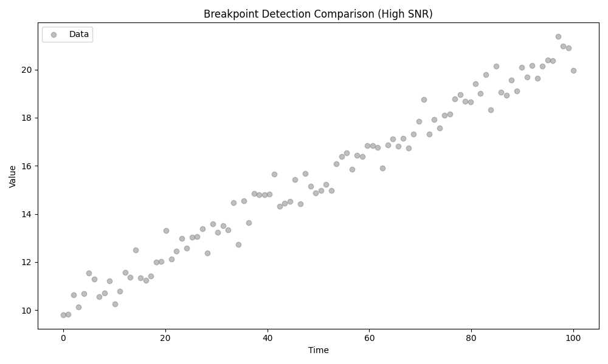
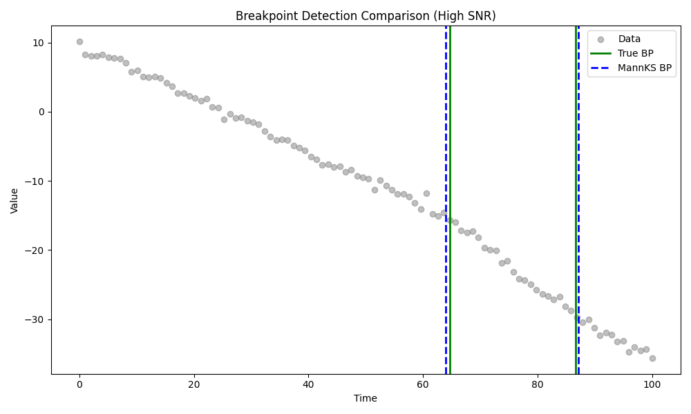

# Validation 50: High SNR Breakpoint Detection

Comparision across 100 random datasets (Non-censored, High SNR, Sigma=0.5) against **Ground Truth**.

## 1. Model Selection Accuracy (Finding Correct Number of Breakpoints)
| Method | Accuracy (Correct N) |
| :--- | :--- |
| Piecewise (OLS) | 88.0% |
| MannKS (Standard AIC) | 93.0% |
| MannKS (Merged) | 94.0% |
| **MannKS (Bagging)** | **96.0%** |

### Confusion Matrices (Rows=True N, Cols=Predicted N)
#### Piecewise (OLS)
|   true_n |   -1 |   0 |   1 |   2 |
|---------:|-----:|----:|----:|----:|
|        0 |    7 |  18 |   0 |   0 |
|        1 |    1 |   0 |  39 |   2 |
|        2 |    1 |   0 |   1 |  31 |

#### MannKS (Standard AIC)
|   true_n |   0 |   1 |   2 |
|---------:|----:|----:|----:|
|        0 |  25 |   0 |   0 |
|        1 |   0 |  39 |   3 |
|        2 |   0 |   4 |  29 |

#### MannKS (Merged)
|   true_n |   0 |   1 |   2 |
|---------:|----:|----:|----:|
|        0 |  25 |   0 |   0 |
|        1 |   0 |  40 |   2 |
|        2 |   0 |   4 |  29 |

#### MannKS (Bagging)
|   true_n |   0 |   1 |   2 |
|---------:|----:|----:|----:|
|        0 |  25 |   0 |   0 |
|        1 |   0 |  41 |   1 |
|        2 |   0 |   3 |  30 |

## 2. Breakpoint Location Accuracy
Absolute Error when the correct number of breakpoints was found.

| Method | Mean | Std Dev | Min | Max |
| :--- | :--- | :--- | :--- | :--- |
| Piecewise (OLS) | 0.6867 | 0.6426 | 0.0000 | 3.0059 |
| MannKS (Standard AIC) | 0.8606 | 2.0275 | 0.0000 | 18.5796 |
| MannKS (Merged) | 0.6278 | 0.7169 | 0.0000 | 3.8293 |
| MannKS (Bagging) | 0.6322 | 0.7181 | 0.0000 | 3.7641 |

## 3. Analysis
*   **Accuracy:** Does enabling merging improve the detection of the correct number of segments?
    *   **Yes.** The merging step improved overall accuracy.
*   **Bagging:** How does the bagging method perform?
    *   Bagging accuracy: 96.0%.
    *   Bagging Mean Location Error: 0.6322 (vs Standard: 0.8606)
*   **Comparison to OLS:** Piecewise OLS is theoretically optimal for this normal noise data. How close is MannKS?
    *   MannKS (Bagging) is within 8.0% accuracy of OLS.

## 4. Example Plots

