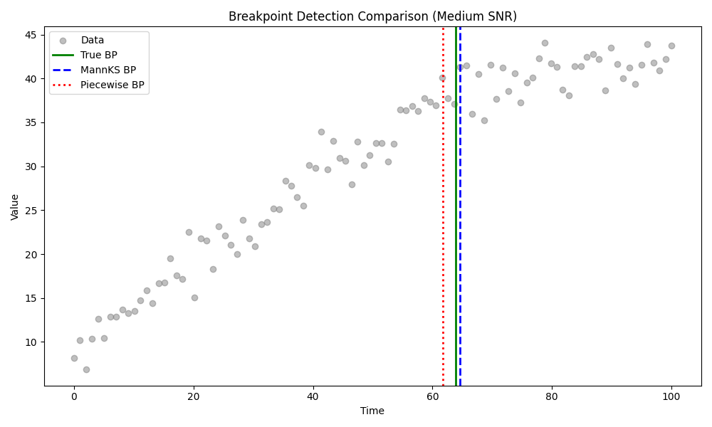
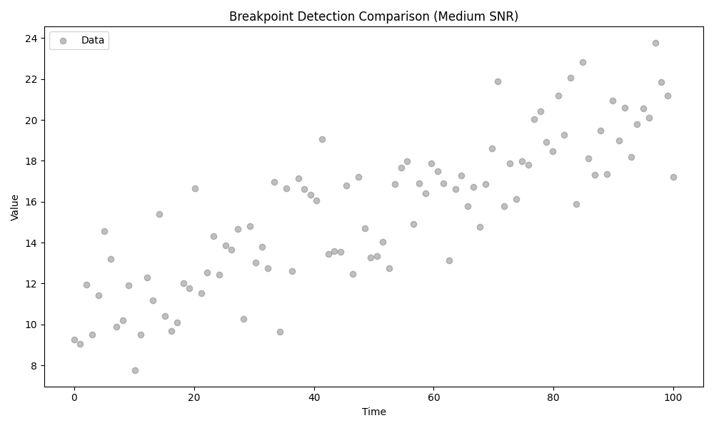
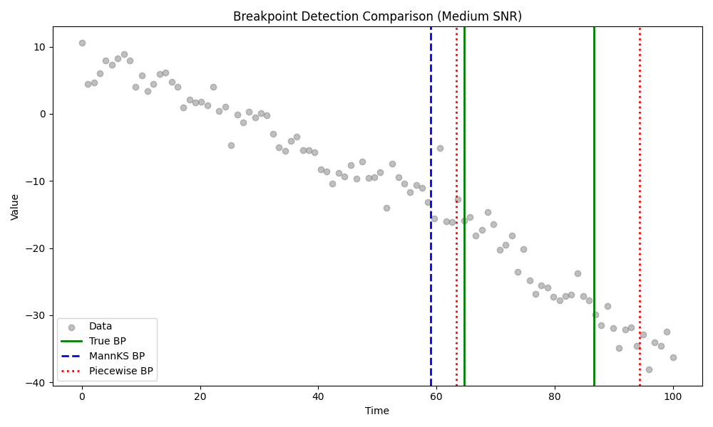

# Validation 51: Medium SNR Breakpoint Detection

Comparision across 100 random datasets (Non-censored, Medium SNR, Sigma=2.0) against **Ground Truth**.

## 1. Model Selection Accuracy (Finding Correct Number of Breakpoints)
| Method | Accuracy (Correct N) |
| :--- | :--- |
| Piecewise (OLS) | 59.0% |
| MannKS (Standard) | 58.0% |
| **MannKS (Merged)** | **58.0%** |

### Confusion Matrices (Rows=True N, Cols=Predicted N)
#### Piecewise (OLS)
|   true_n |   -1 |   0 |   1 |   2 |
|---------:|-----:|----:|----:|----:|
|        0 |    8 |  17 |   0 |   0 |
|        1 |    4 |   3 |  32 |   3 |
|        2 |    4 |   0 |  19 |  10 |

#### MannKS (Standard)
|   true_n |   0 |   1 |   2 |
|---------:|----:|----:|----:|
|        0 |  25 |   0 |   0 |
|        1 |  12 |  30 |   0 |
|        2 |   4 |  26 |   3 |

#### MannKS (Merged)
|   true_n |   0 |   1 |   2 |
|---------:|----:|----:|----:|
|        0 |  25 |   0 |   0 |
|        1 |  12 |  30 |   0 |
|        2 |   4 |  26 |   3 |

## 2. Breakpoint Location Accuracy
Mean Absolute Error (MAE) when the correct number of breakpoints was found.

| Method | Mean Location Error |
| :--- | :--- |
| Piecewise (OLS) | 2.5323 |
| MannKS (Standard) | 1.3854 |
| MannKS (Merged) | 1.3845 |

## 3. Analysis
*   **Accuracy:** Does enabling merging improve the detection of the correct number of segments (specifically reducing over-segmentation)?
    *   **Neutral.** Performance was identical.
*   **Comparison to OLS:** Piecewise OLS is theoretically optimal for this normal noise data. How close is MannKS?
    *   MannKS (Merged) is within 1.0% accuracy of OLS.

## 4. Example Plots

