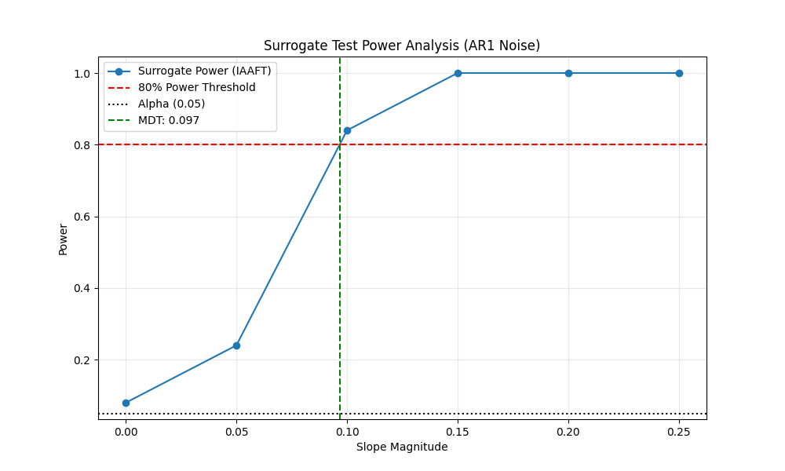

# Validation Case 56: Surrogate Power Analysis

This validation case examines the `power_test` functionality for surrogate data testing.

## Simulation Setup
- **Data**: AR(1) Red Noise ($\rho=0.7$), N=50
- **Method**: IAAFT Surrogates
- **Simulations**: 50 per slope
- **Inner Surrogates**: 200

## Results
The table below shows the estimated power (detection rate) for each slope.

 slope  power  n_detected
  0.00   0.08           4
  0.05   0.24          12
  0.10   0.84          42
  0.15   1.00          50
  0.20   1.00          50
  0.25   1.00          50

**Minimum Detectable Trend (80% Power):** 0.0967

## Power Curve

