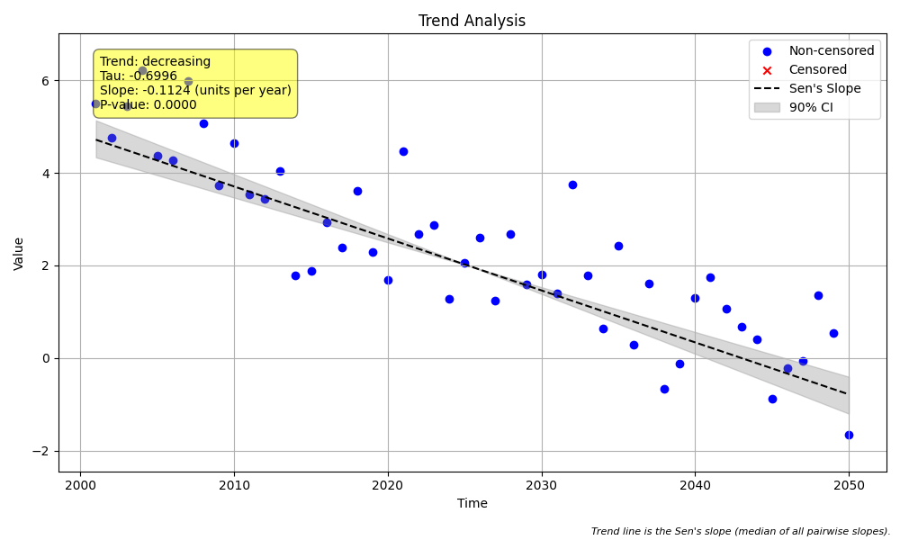

# Validation Case V-02: Simple Decreasing Trend

## Objective
This validation case verifies that all methods can correctly identify a statistically significant, **negative** trend in a simple, non-seasonal, uncensored dataset.

## Data
A synthetic dataset of 50 annual samples was generated with a known negative slope. The generated plot from the standard `MannKS` analysis is shown below.



```python
import pandas as pd
import numpy as np
import MannKS as mk

# Generate Data
np.random.seed(42)
n = 50
t = pd.to_datetime(pd.date_range(start='2000-01-01', periods=n, freq='YE'))
slope = -0.1
intercept = 5
noise = np.random.normal(0, 1, n)
x = slope * np.arange(n) + intercept + noise

# Run MannKS (Standard)
mk_standard = mk.trend_test(x, t)

# Run MannKS (LWP Mode)
mk_lwp = mk.trend_test(
    x, t,
    mk_test_method='lwp',
    ci_method='lwp',
    tie_break_method='lwp'
)

print("Standard MK p-value:", mk_standard.p)
print("LWP MK p-value:", mk_lwp.p)
```

## Results Comparison

The following table compares the key statistical outputs from the three analysis methods.

| Metric              | MannKS (Standard) | MannKS (LWP Mode) | LWP-TRENDS R Script |
|---------------------|-----------------------|-----------------------|---------------------|
| p-value             | 0.000000   | 0.000000        | 0.000000     |
| Sen's Slope         | -0.112356 | -0.112356    | -0.112356       |
| Lower CI (90%)      | -0.129413 | -0.129365 | -0.129365    |
| Upper CI (90%)      | -0.096799 | -0.096815 | -0.096815    |

## Analysis

The results show that all three methods correctly identified a significant **decreasing** trend (p < 0.05).

As with the increasing trend case, the results from **MannKS (LWP Mode)** are nearly identical to the **LWP-TRENDS R Script**, confirming the LWP-compatibility settings are working as expected. The **MannKS (Standard)** results are also very close, which is anticipated for a simple, uncensored dataset.