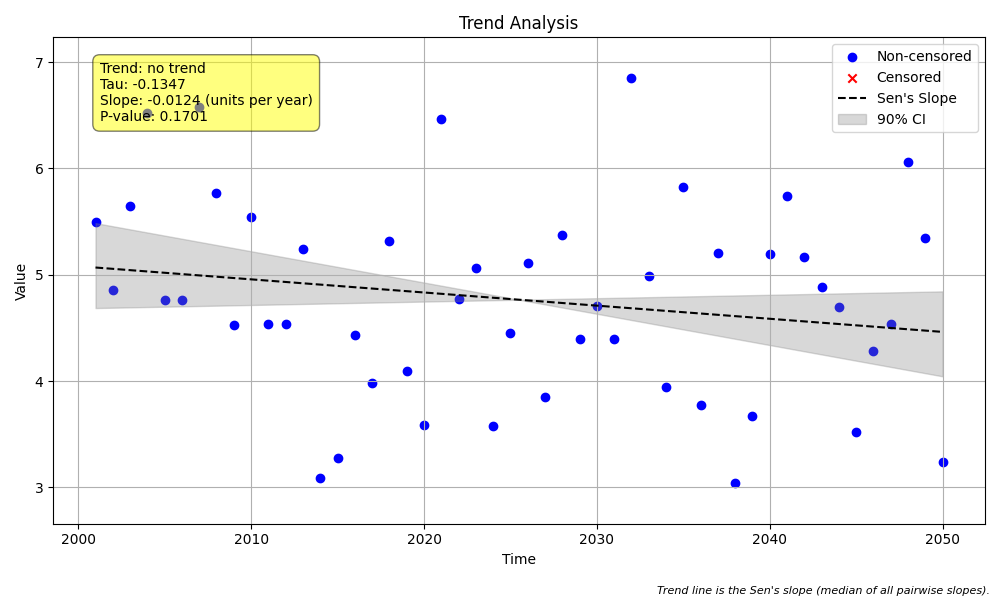

# Validation Case V-03: No Trend

## Objective
This validation case verifies that all methods correctly identify a lack of trend in a dataset composed of random noise.

## Data
A synthetic dataset of 50 annual samples was generated with a slope of 0. The data consists only of random noise around a constant value. The generated plot is shown below.



```python
import pandas as pd
import numpy as np
import MannKS as mk

# Generate Data
np.random.seed(42)
n = 50
t = pd.to_datetime(pd.date_range(start='2000-01-01', periods=n, freq='YE'))
slope = 0.0
intercept = 5
noise = np.random.normal(0, 1, n)
x = slope * np.arange(n) + intercept + noise

# Run MannKS Analyses
mk_standard = mk.trend_test(x, t)
mk_lwp = mk.trend_test(
    x, t,
    mk_test_method='lwp',
    ci_method='lwp',
    tie_break_method='lwp'
)

print("Standard MK p-value:", mk_standard.p)
print("LWP MK p-value:", mk_lwp.p)
```

## Results Comparison

The following table compares the key statistical outputs from the three analysis methods.

| Metric              | MannKS (Standard) | MannKS (LWP Mode) | LWP-TRENDS R Script |
|---------------------|-----------------------|-----------------------|---------------------|
| p-value             | 0.170114   | 0.170114        | 0.170114     |
| Sen's Slope         | -0.012359 | -0.012359    | -0.012359       |
| Lower CI (90%)      | -0.029413 | -0.029365 | -0.029365    |
| Upper CI (90%)      | 0.003202 | 0.003187 | 0.003187    |

## Analysis

The results show that all three methods correctly identified a lack of a significant trend, with high p-values (p > 0.1).

The Sen's slope values are all very close to zero, which is the expected outcome for this dataset. The LWP-mode and R script results are again nearly identical, reinforcing the consistency of the LWP emulation. This case successfully validates the correct behavior of the trend tests on random data.