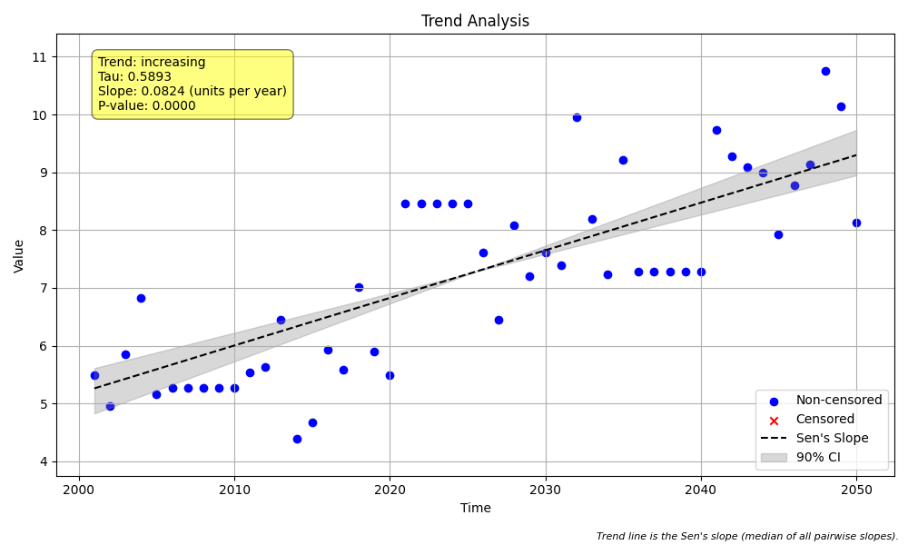

# Validation Case V-04: Data with Tied Values

## Objective
This validation case tests the handling of tied values in the data vector by all three analysis methods.

## Data
A synthetic dataset of 50 annual samples was generated with a positive slope. Multiple runs of identical (tied) values were intentionally introduced into the dataset.



```python
import pandas as pd
import numpy as np
import MannKS as mk

# Generate Data
np.random.seed(42)
n = 50
t = pd.to_datetime(pd.date_range(start='2000-01-01', periods=n, freq='YE'))
slope = 0.1
intercept = 5
noise = np.random.normal(0, 1, n)
x = slope * np.arange(n) + intercept + noise
# Introduce ties
x[5:10] = x[5]
x[20:25] = x[20]
x[35:40] = x[35]

# Run MannKS Analyses
mk_standard = mk.trend_test(x, t, tau_method='b') # Default is 'b' for ties
mk_lwp = mk.trend_test(
    x, t,
    mk_test_method='lwp',
    ci_method='lwp',
    tie_break_method='lwp'
)

print("Standard MK p-value:", mk_standard.p)
print("LWP MK p-value:", mk_lwp.p)
```

## Results Comparison

The following table compares the key statistical outputs from the three analysis methods.

| Metric              | MannKS (Standard) | MannKS (LWP Mode) | LWP-TRENDS R Script |
|---------------------|-----------------------|-----------------------|---------------------|
| p-value             | 0.000000   | 0.000000        | 0.000000     |
| Sen's Slope         | 0.082351 | 0.082351    | 0.082351       |
| Lower CI (90%)      | 0.068091 | 0.068104 | 0.068116    |
| Upper CI (90%)      | 0.100085 | 0.100084 | 0.100082    |

## Analysis
All three methods correctly identified the significant increasing trend despite the presence of tied values.

The `MannKS` package's standard method uses the Mann-Kendall Tau-b test, which is specifically designed to correctly handle ties in the variance calculation. The LWP emulation mode uses a different tie-breaking method (`tie_break_method='lwp'`) designed to replicate the R script's behavior.

As shown in the table, the results from **MannKS (LWP Mode)** and the **LWP-TRENDS R Script** are nearly identical, demonstrating a successful replication of the R script's tie-handling logic. The standard method produces a slightly different but statistically consistent result.