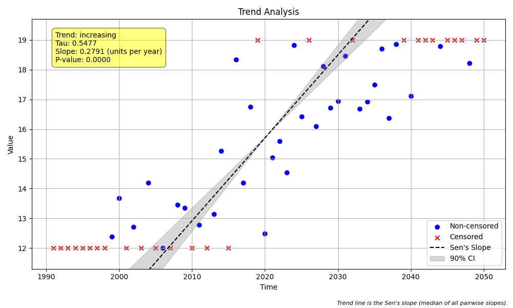

# Validation Case V-07: Mixed Censoring

## Objective
This validation case verifies the handling of a dataset that contains both left-censored (`<`) and right-censored (`>`) data.

## Data
A synthetic dataset of 60 annual samples was generated with a positive slope. Values below `12.0` were left-censored, and values above `19.0` were right-censored. The generated plot from the standard `MannKS` analysis is shown below.



```python
import pandas as pd
import numpy as np
import MannKS as mk

# Generate Data
np.random.seed(45)
n = 60
t = pd.to_datetime(pd.date_range(start='1990-01-01', periods=n, freq='YE'))
slope = 0.2
intercept = 10
noise = np.random.normal(0, 2.0, n)
x = slope * np.arange(n) + intercept + noise

# Introduce mixed-censoring
left_censor_threshold = 12.0
right_censor_threshold = 19.0
x_censored = []
for val in x:
    if val < left_censor_threshold:
        x_censored.append(f"<12.0")
    elif val > right_censor_threshold:
        x_censored.append(f">19.0")
    else:
        x_censored.append(val)

# Pre-process and run MannKS
processed_data = mk.prepare_censored_data(x_censored)
mk_results = mk.trend_test(processed_data, t)
print("p-value:", mk_results.p)
```

## Results Comparison

| Metric              | MannKS (Standard) | MannKS (LWP Mode) | LWP-TRENDS R Script |
|---------------------|-----------------------|-----------------------|---------------------|
| p-value             | 0.000002   | 0.000000        | 0.000000     |
| Sen's Slope         | 0.279090 | 0.252884    | 0.252884       |
| Lower CI (90%)      | 0.238325 | 0.209799 | 0.210333    |
| Upper CI (90%)      | 0.313065 | 0.289755 | 0.289331    |

## Analysis
This case combines the behaviors seen in the individual left-censored and right-censored tests.

The **MannKS (LWP Mode)** continues to closely replicate the **LWP-TRENDS R Script** by using the same data substitution heuristics for both left- and right-censored data.

The **MannKS (Standard)** method uses its robust ranking approach for both types of censoring, treating ambiguous comparisons conservatively. As expected, this results in a slightly higher (less significant) p-value and a different Sen's slope, reflecting the increased uncertainty from having both left- and right-censored data in the same analysis.