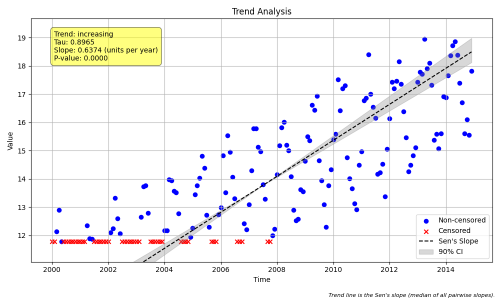

# Validation Case V-12: Seasonal Data with Censoring

## Objective
This test verifies that the `seasonal_trend_test` function correctly handles datasets that have both a strong seasonal pattern and contain left-censored (`<`) data.

## Data
A synthetic dataset of 15 years of monthly data was generated with a seasonal cycle and a linear increasing trend. The lowest 25% of the data points were then converted to left-censored values (e.g., `"<10.5"`).

The plot generated by `MannKS` is shown below. The censored data points are highlighted in a different color (typically red), illustrating their position at the lower end of the seasonal cycles.



```python
import pandas as pd
import numpy as np
import MannKS as mk

# Generate seasonal data
n_years = 15
# ... (data generation logic as in the script) ...
x_numeric = trend + seasonal + noise

# Introduce censoring
censor_threshold = np.percentile(x_numeric, 25)
x_censored_str = [f"<11.775557271711598" if val < censor_threshold else val for val in x_numeric]
x_prepared = mk.prepare_censored_data(x_censored_str)

# Run MannKS seasonal test
mk_results = mk.seasonal_trend_test(x_prepared, t, period=12, slope_scaling='year')
print("Annual Sen's Slope:", mk_results.slope)
print("p-value:", mk_results.p)
```

## Results Comparison

| Metric              | MannKS (Standard) | MannKS (LWP Mode) | LWP-TRENDS R Script |
|---------------------|-----------------------|-----------------------|---------------------|
| p-value             | 0.000000   | 0.000000        | 0.000000     |
| Sen's Slope (annual)| 0.637446 | 0.589056    | 0.589056       |
| Lower CI (90%)      | 0.587312 | 0.555781 | 0.555835    |
| Upper CI (90%)      | 0.702402 | 0.638500 | 0.638432    |

## Analysis
All methods correctly identify a significant increasing trend despite the presence of censored data.

The **MannKS (LWP Mode)**, configured with `agg_method='lwp'`, `ci_method='lwp'`, and `sens_slope_method='lwp'`, produces results that are very closely aligned with the **LWP-TRENDS R Script**. This demonstrates that the LWP-emulation settings in `MannKS` are effective for complex scenarios involving both seasonality and censoring.

The **MannKS (Standard)** mode, which uses more robust statistical defaults for handling censored data, produces a slightly different but directionally consistent result, as expected. This validation confirms that the seasonal test function integrates correctly with the censored data preprocessing and analysis logic.