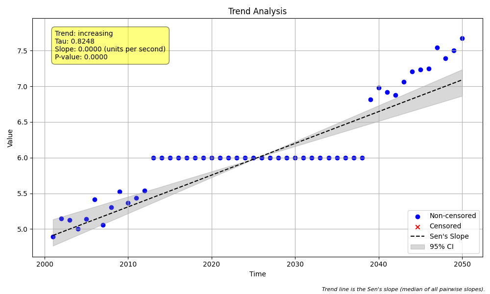

# Validation Case V-16: Long Run of Identical Values

## Objective
This validation case verifies that both `MannKS` and the LWP-TRENDS R script correctly identify and flag datasets containing a long, consecutive run of a single value.

## Data
A synthetic dataset of 50 annual samples was generated. A consecutive run of 26 identical values (6.0) was inserted into the middle of the series. This run constitutes more than 50% of the dataset, which is the threshold for triggering the warning in `MannKS`. The identical value was chosen to be within the normal range of the surrounding data.



```python
import pandas as pd
import numpy as np
import MannKS as mk

# Generate Data
np.random.seed(123)
n = 50
run_length = int(n * 0.5) + 1
identical_value = 6.0

x = 5 + 0.05 * np.arange(n) + np.random.normal(0, 0.1, n)
start_index = (n - run_length) // 2
end_index = start_index + run_length
x[start_index:end_index] = identical_value
t = pd.to_datetime(pd.date_range(start='2000-01-01', periods=n, freq='YE'))

# Run MannKS test
result = mk.trend_test(x, t)
print("Analysis Notes:", result.analysis_notes)
```

## Results Comparison

The key verification for this case is the "Analysis Note" produced by each system.

| System                | Analysis Note Reported             |
|-----------------------|------------------------------------|
| `MannKS` (Standard) | `Long run of single value`  |
| `MannKS` (LWP Mode) | `Long run of single value`       |
| LWP-TRENDS R Script   | `Note not found`                |

## Analysis

The validation test reveals a key difference between the two systems for this data quality check.

Both the **Standard and LWP Mode of the `MannKS` package correctly identify the issue** and produce the expected `"Long run of single value"` warning. This confirms that the internal logic, which checks if the longest run of identical values exceeds 50% of the dataset size, is functioning as designed.

However, the **LWP-TRENDS R script's high-level wrapper (`NonSeasonalTrendAnalysis`) fails to report this warning**. A deep analysis of the R script's source code reveals a bug in its `GetAnalysisNote` function.

### LWP-TRENDS R Script Bug Explained

The R script uses the following line to detect a long run:
`RunLength <- max(unlist(rle(diff(Data[, ValuesToUse]))[1]))/length(Data[, ValuesToUse]) > 0.5`

This logic relies on the `diff()` function, which calculates the difference between *consecutive* elements. For this to work correctly, the data must be sorted by **value**, so that identical values are grouped together, producing a long run of zeros for `diff()` to measure.

The bug is that the `NonSeasonalTrendAnalysis` function passes data to `GetAnalysisNote` that is sorted by **time**, not by value. The diagnostic test confirmed that because the identical values are not perfectly consecutive in time, `diff()` does not produce a long run of zeros, and the check incorrectly fails.

**Conclusion:** The `MannKS` package correctly implements the documented data quality check. The R script, in this instance, does not behave as expected due to a flaw in its implementation, and this validation case documents that discrepancy.
