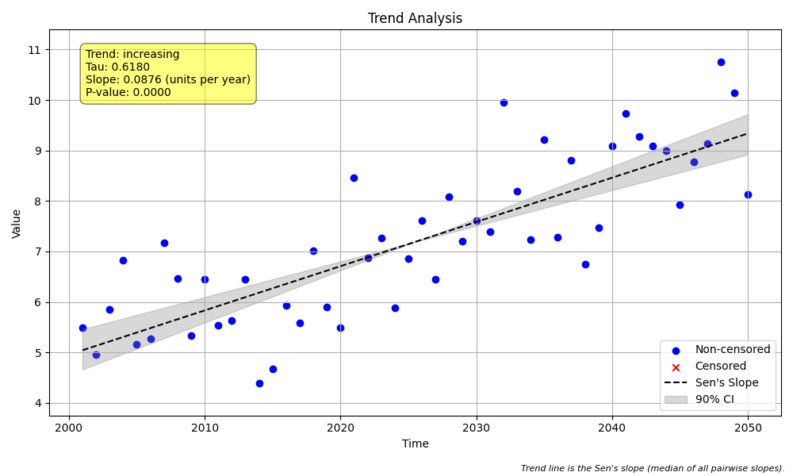

# Validation Case V-17: Confidence Interval Method

## Objective
This validation case isolates and verifies the two different methods for calculating Sen's slope confidence intervals: `'direct'` (default) and `'lwp'` (for LWP-TRENDS compatibility).

## Data
A simple synthetic dataset of 50 annual samples was generated with a known positive slope. This dataset is identical to the one used in V-01.



```python
import pandas as pd
import numpy as np
import MannKS as mk

# Generate Data
np.random.seed(42)
n = 50
t = pd.to_datetime(pd.date_range(start='2000-01-01', periods=n, freq='YE'))
slope = 0.1
intercept = 5
noise = np.random.normal(0, 1, n)
x = slope * np.arange(n) + intercept + noise

# Run MannKS with default 'direct' CI method
mk_standard = mk.trend_test(x, t, alpha=0.1)

# Run MannKS with LWP-compatible 'lwp' CI method
mk_lwp = mk.trend_test(x, t, alpha=0.1, ci_method='lwp')

print(f"Direct CI:  ({mk_standard.lower_ci:.4f}, {mk_standard.upper_ci:.4f})")
print(f"LWP CI:     ({mk_lwp.lower_ci:.4f}, {mk_lwp.upper_ci:.4f})")
```

## Results Comparison

The key verification for this case is the comparison of the 90% confidence intervals for the Sen's slope.

| Metric              | MannKS (`ci_method='direct'`) | MannKS (`ci_method='lwp'`) | LWP-TRENDS R Script |
|---------------------|-----------------------------------|--------------------------------|---------------------|
| Sen's Slope         | 0.087639           | 0.087639             | 0.087639       |
| Lower CI (90%)      | 0.070587        | 0.070635          | 0.070635    |
| Upper CI (90%)      | 0.103204        | 0.103189          | 0.103189    |
| p-value             | 0.000000               | 0.000000                 | 0.000000     |

## Analysis

The results clearly demonstrate the difference between the two confidence interval calculation methods.

The **LWP-TRENDS R Script** calculates the ranks for the confidence interval bounds as floating-point numbers and then uses linear interpolation between the adjacent slopes to find the final CI values.

The **`MannKS` (LWP Mode)**, with `ci_method='lwp'`, successfully replicates this interpolation behavior, producing confidence intervals that are nearly identical to the R script's output. This confirms the correctness of the LWP-compatibility mode for this specific parameter.

The **`MannKS` (Standard)** mode, using the default `ci_method='direct'`, produces slightly different confidence intervals. This method rounds the calculated ranks to the nearest integer and directly selects the corresponding slopes from the sorted list of all pairwise slopes. This is a common and statistically valid approach that avoids interpolation.

This validation case confirms that the `ci_method` parameter functions as designed, allowing users to choose between a direct-indexing method and a legacy-compatible interpolation method.
